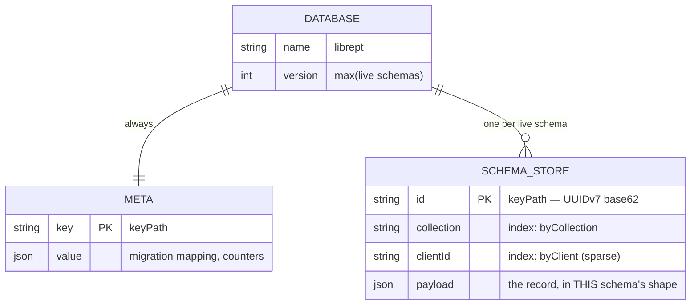
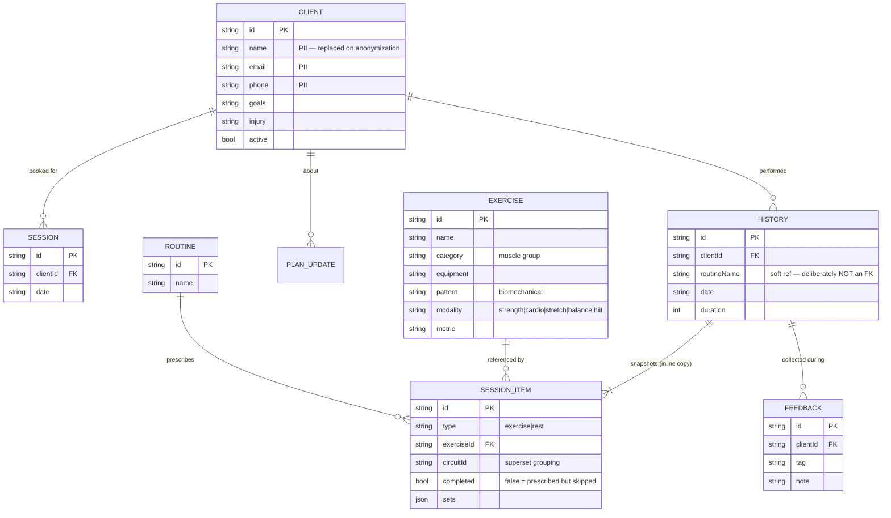
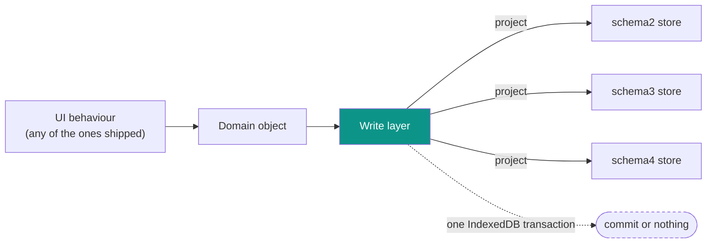

# LibrePT Data Model & Storage Schema

How LibrePT stores a trainer's data, and why it is shaped this way. Design rationale and open
questions live in [TODO §18](../TODO.md); this document is the reference for what exists.

> **Status:** the physical layout below is **built** ([indexedDb.js](../src/data/indexedDb.js)); the
> star-write layer that fills it is **in progress**. The main read/write path still runs through
> `localStorage` via [stateStore.js](../src/data/stateStore.js) until that move lands.

---

## 1. The two version axes

The single most important thing to keep straight — and the one thing never to collapse into one
number:

| Axis | What it identifies | Shape | Where it lives |
| :--- | :--- | :--- | :--- |
| **Behaviour** | Which UI/logic a trainer is using | a named behaviour, selectable in-app | one deployed build carries them all |
| **Data schema** | The shape of a stored record | plain integer major | `schemaVersion`, [migrationSteps.js](../src/data/migrationSteps.js) |

**There are no release tags and no rollback-by-navigation.** One build ships every supported
behaviour concurrently, so switching behaviour is an in-app choice, not a different URL and not a
different deployment. The data schema is the only axis storage is keyed on.

A schema major is bumped **only** when a migration step is added. A "patch" to a schema is either a
migration step or it is nothing.

---

## 2. Physical layout — one database, one store per schema



**One database is a correctness constraint, not a preference.** IndexedDB transactions cannot span
*databases*. Giving each schema its own database would make an atomic star write impossible by
construction — and a phone locking mid-fan-out would leave one schema written and another not.

Store names are `schema2`, `schema3`, … The database `version` is derived from the highest live
schema, so provisioning a schema is the only thing that triggers `onupgradeneeded`. Provisioning is
additive: a retired schema's store is never dropped as a side effect of booting: discarding a bucket
is a deliberate act.

### Indexes, and what they are for

| Index | Key path | Purpose |
| :--- | :--- | :--- |
| `byCollection` | `collection` | Load one collection without scanning the store |
| `byClient` | `clientId` | **Lazy per-client load** — one index hit instead of deserialising every client's history to render one screen |

`byClient` is sparse: records with no owner (the exercise catalog) simply do not appear in it.
`count()` on an index goes through its B-tree, which is what makes the migration-completeness check
(§4) cheap rather than a full scan.

---

## 3. Logical record model

The collections, and the references between them. **The reference graph must stay acyclic** — see §4.



Three modelling decisions worth knowing before changing anything here:

- **History embeds a frozen copy of the program**, not a reference to a live routine. Editing a
  routine must never rewrite the past. This makes history the fastest-growing collection.
- **`SESSION_ITEM` is a flat typed array**, not a nested superset container — `circuitId` grouping is
  folded at render. The live session and the frozen record use the *same* model, so there is no second
  representation to drift.
- **`routineName` is a soft string reference on purpose.** Making template provenance a hard FK would
  create `history → routine → history`, the first cycle in the graph, and break §4's ordering.

---

## 4. Star writes — one domain object, every live schema

The data layer does not migrate a chain (`v2 → v3 → v4`). It **projects**, directly from the live
domain object into every schema that is currently live:



**Why a star and not a chain.** In a chain, lossiness compounds and each step is tested against the
previous step's output rather than against reality. In a star, every projection is computed from the
same source, so error cannot compound and each is independently testable. There are also **no
backward transforms to write** — a "downgrade" is just a projection that was already being written.

### Invariants the star depends on

| Invariant | Why |
| :--- | :--- |
| Projections are **pure and total** | Buckets stay fully re-derivable, so a divergence is repairable by re-projection rather than by restore |
| The fan-out is **one transaction** | A phone locking mid-write cannot leave schemas disagreeing |
| Ids are **stable across projections** | The same logical record is the same key in every store |
| The reference graph is **acyclic** | Migration replays in topological (foreign-key availability) order, never by timestamp — the device clock is not trustworthy |
| Schema changes are **expand-first** | A field's storage ships in every live schema *before* the UI that writes it, so no projection is ever lossy |

### Migration

Migration into a newly live schema is **pre-emptive** (it starts before a trainer opts into anything),
**resumable** (a phone dies mid-way and it picks up), and runs **through the normal write layer** —
`read old record → build domain object → star write` — so there is no second transform to drift.

The `meta` store holds the id mapping, which doubles as the cursor: *present in the mapping* means
*migrated*. Ordinary use therefore **accelerates** migration, because a star write to a not-yet-
migrated record populates the new store and marks it, and migration then skips it.

**Completeness is a query, never a stored flag:**

```
count(source records) === count(mapping entries for that schema)
```

Derived state cannot drift the way a flag written at the wrong moment can. This is sound *because
there are no deletes* — the mapping can never hold an entry whose source has gone, so equal counts
cannot hide a mismatched pair. A store whose migration is incomplete is **not readable**: a crash at
40% must not show a trainer 40% of their clients.

---

## 5. Deletion, erasure and retention

**There are no hard deletes.** Erasure is **anonymization**: client PII is replaced with an anonymous
token and the execution records stay, so longitudinal analytics survive.

Two consequences that are easy to get wrong:

- **Anonymization fans out like any other write.** If one store keeps the name and another is
  anonymized, the erasure has failed.
- **The suppression list must be applied at import, not only at erasure.** Restoring a pre-erasure
  backup would otherwise resurrect the PII. It is keyed on the stable record id and stores a salted
  hash and nothing else.

---

## 6. Durability

The database holds the **only** copy of a trainer's records — there is no server. So:

- `navigator.storage.persist()` is requested on boot; without it a browser may reclaim IndexedDB under
  storage pressure, and Safari caps script-writable storage for sites unopened for seven days.
- Risk is reported by **measuring the consequence** (quota, persistence) rather than by sniffing for
  private browsing — see [storageDurability.js](../src/data/storageDurability.js).
- The **backup file is the disaster-recovery tier**, and the only recovery path from a write-layer
  bug. Backups export the newest schema's store only (every other store is derived), and old backups
  stay importable indefinitely: readers are retained forever, writers never.

---

## Related

- [TODO §18](../TODO.md) — design rationale, decisions and open questions
- [indexedDb.js](../src/data/indexedDb.js) — the adapter implementing §2
- [recordId.js](../src/modules/common/recordId.js) — UUIDv7 identity
- [storageDurability.js](../src/data/storageDurability.js) — §6
- [PRIVACY.md](../PRIVACY.md) — the GDPR statement §5 serves
