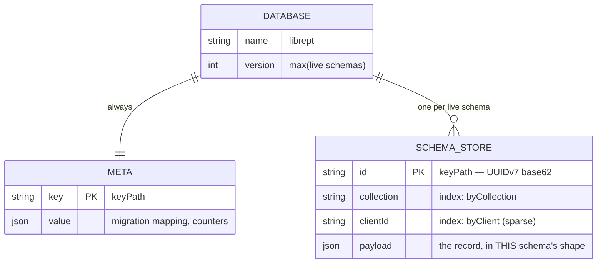
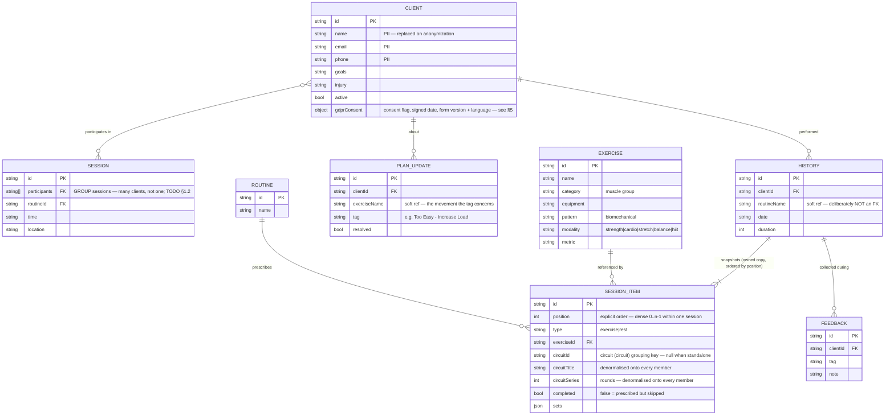
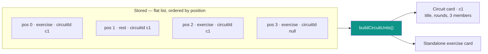

# LibrePT Data Model & Storage Schema

How LibrePT stores a trainer's data, and why it is shaped this way. Design rationale and open
questions live in [TODO §18](../TODO.md); this document is the reference for what exists.

> **Status:** the physical layout is **built** ([indexedDb.js](../src/data/indexedDb.js)) and the
> main read/write path now runs through it
> ([stateStore.js](../src/data/stateStore.js), TODO §18.6 part 4) — `getState()`/`setState()` stay
> synchronous, only load-at-boot and save-on-write are async, via a one-time, revertable import from
> the legacy `localStorage` bucket (left untouched as the rollback snapshot). **Still pending:**
> §17.1's lazy per-client load — every collection is still fully hydrated at boot, not loaded
> on-demand per client — and §16.5/§16.3 (retiring multi-version hosting, rekeying buckets on the
> schema major).

---

## 1. The two version axes

The single most important thing to keep straight — and the one thing never to collapse into one
number:

| Axis | What it identifies | Shape | Where it lives |
| :--- | :--- | :--- | :--- |
| **Behaviour** | Which UI/logic a trainer is using | a named behaviour, selectable in-app | one deployed build carries them all |
| **Data schema** | The shape of a stored record | plain integer major | `schemaVersion`, [migrationSteps.js](../src/data/migrationSteps.js) |

**`lang` is nullable, and that is load-bearing.** It holds the language the trainer *chose*; null
means they have never been asked. The language the UI actually renders in is a separate question,
answered by `resolveLang()` in [i18n/index.js](../src/i18n/index.js), which falls back to English.

Collapsing the two — as the app once did, forcing `"en"` wherever the field was absent — makes
"picked English" and "never asked" the same stored value, and there is no way back from it: the
splash cannot offer a language to exactly the people who have not chosen one. The migration
therefore CLEARS the stored language for every pre-release database rather than trying to infer
intent from it. One tap for someone who did want English; the alternative is a Slovene trainer
stuck in an English app with no prompt.

### Only two schema versions exist: 0 and 5

`schemaVersion` runs **0 → 5**, and nothing in between. **0** is the pre-release shape (the field
absent, 0, or garbage); **5** is what every current build reads and writes, and the version LibrePT
ships at release. LibrePT has not shipped, so the four steps that once described an upgrade history
were collapsed into a single `0 → 5` transform — legitimate *only* while no trainer holds data. Once
one does, the rule inverts to §6's: readers retained forever, steps appended, never squashed.

**1, 2, 3 and 4 are retired, and never recycled.** All four were stamped into real pre-release
databases. A database still carrying one is rescued by a **comparison** — anything below current
re-enters at the floor — rather than by a hardcoded set of dead numbers, which would need
maintaining and would silently refuse any value nobody remembered to list.

That comparison is the whole reason the chain **starts at 5 rather than 1**. Numbering current as 1
would put three retired values *above* it, where they read as "written by a newer build" and get
refused — stranding exactly the databases the rule exists to rescue. A unit test in
[schemaMigrations.test.mjs](../tests/unit_js/data/schemaMigrations.test.mjs) fails the build if
current ever drops back below the retired range.

**"P" is the pre-release placeholder for 5** — the same version under a name that says it is not
settled. 5 becomes the stable release schema; until then, P is what the shape is called while it can
still move.

That carries one consequence worth stating plainly: **a placeholder shape can change without the
number changing.** Two preview databases can both read `schemaVersion: 5` and hold different shapes,
and `migrateState` will compare 5 against 5, apply nothing, and report success — the version cannot
tell them apart. Only the **commit SHA** can, which is why a preview backup has to carry it, and why
the two axes above stay separate: the chain numbers the **data**, the SHA identifies the **code**.
At release the shape settles and the number starts meaning what it says.

**There are no release tags and no rollback-by-navigation.** One build ships every supported
behaviour concurrently, so switching behaviour is an in-app choice, not a different URL and not a
different deployment. The data schema is the only axis storage is keyed on.

A schema major is bumped **only** when a migration step is added. A "patch" to a schema is either a
migration step or it is nothing.

---

## 2. Physical layout — one database, one store per schema



**One database is a correctness constraint, not a preference.** IndexedDB transactions cannot span
*databases*. Giving each schema its own database would make an atomic star write impossible by
construction — and a phone locking mid-fan-out would leave one schema written and another not.

Store names are `schema2`, `schema3`, … The database `version` is derived from the highest live
schema, so provisioning a schema is the only thing that triggers `onupgradeneeded`. Provisioning is
additive: a retired schema's store is never dropped as a side effect of booting: discarding a bucket
is a deliberate act.

### Indexes, and what they are for

| Index | Key path | Purpose |
| :--- | :--- | :--- |
| `byCollection` | `collection` | Load one collection without scanning the store — "the whole exercise catalog," no client dimension |
| `byClient` | `clientId` | **Whole-client scan** — every collection touched by one client, unnarrowed. What §5's erasure/anonymization sweep needs: touch every record type for one client |
| `byClientAndCollection` | `[clientId, collection]` | **Lazy per-client load** — one client's HISTORY specifically, one index hit. `byClient` alone would return that client's `planUpdates` interleaved too, costing a client-side filter over records the load never wanted deserialised |

Both client-scoped indexes are sparse: records with no owner (the exercise catalog) simply do not
appear in either. A compound index is sparse the same way — a record missing *either* path is
absent from it, not present with a `null`. `getAllKeys()` walks an index's B-tree and returns keys
**without deserialising payloads**, which is what makes the migration-completeness check (§4) — a
set difference over two stores' keys — cheap rather than a full scan.

---

## 3. Logical record model

The collections, and the references between them. **The reference graph must stay acyclic** — see §4.
This diagram is the relationship map and stays illustrative rather than exhaustive (it omits, for
instance, `SESSION.title`/`maxCapacity`); [recordSchemas.js](../src/data/recordSchemas.js) is the
enforced, field-exact source of truth, checked in CI against real data — see §4.



Three modelling decisions worth knowing before changing anything here:

- **History owns a frozen copy of the program**, not a reference to a live routine. Editing a routine
  must never rewrite the past. "Copy, not reference" is a *semantic* rule and outlives the storage
  engine: whether the items sit in the history record's payload or in rows of their own, they belong
  to that record and never re-point at a live routine. This makes history the fastest-growing
  collection.
- **`SESSION_ITEM` is a flat typed list**, not a nested circuit container — `circuitId` grouping is
  folded at render (see *Circuits* below), and sequence comes from `position` (see *Ordering* below). The live session and the frozen record use the *same*
  model, so there is no second representation to drift.
- **`routineName` is a soft string reference on purpose.** Making template provenance a hard FK would
  create `history → routine → history`, the first cycle in the graph, and break §4's ordering.
- **`SESSION.participants` is many-to-many, not the single `clientId` an earlier version of this
  diagram drew.** A session can hold several clients (TODO §1.2's group-session merge) and a client
  sits in many sessions, so the CLIENT↔SESSION edge is `}o--o{`. **Open, not built**: whether that
  earns `participants` a `multiEntry` IndexedDB index (one entry per participant, so "this client's
  upcoming sessions" is an index hit) — sessions are a small, bounded collection next to history's
  unbounded growth, so this stays a documented question rather than a built index until a real
  consumer needs the query.

### Ordering — explicit, dense, checkable

**Order is data, carried in the record.** Every `SESSION_ITEM` holds an integer `position`, and
readers **sort by it**. Nothing about how the records are stored is allowed to imply sequence.

The rule the whole scheme rests on:

```
positions(one session's items) === [0, 1, 2, … , n-1]     — dense, unique, gapless
```

**Why explicit at all: the store no longer preserves order for us.** On JSON, sequence rode along
free in an array; the move to IndexedDB (§2, [TODO §18.6](../TODO.md)) retires that. Records are
keyed and indexed, and a key order is not a program order — so unless order is a *field*, a
projection, a per-row store or an import loses it with nothing left to rebuild from. The §4
completeness check would not notice, because every id is still present and only the sequence is
wrong: a scrambled session that passes every integrity test we have. **`position` is therefore a
prerequisite of the engine move, not a follow-up to it.**

Two invariants fall out of density, neither of which any implicit scheme could express:

| Invariant | Check | What it catches |
| :--- | :--- | :--- |
| **Dense and unique** | sorted positions equal `0..n-1` | a dropped item, a duplicated item, a half-applied reorder, a projection that wrote a partial list |
| **Circuit members are contiguous** | per `circuitId`: `max(position) - min(position) + 1 === member count` | a circuit split in two by an item wedged into the middle |

#### Why not a linked list

`nextId` / `prevId` pointers are the more *flexible* representation, and that is the wrong axis to
optimise. Three properties are on offer and no scheme gives all three:

| Scheme | Cheap insert / move | Ordered read | Integrity checkable |
| :--- | :--- | :--- | :--- |
| **Dense `position`** | renumber the tail | index range scan, already sorted | **yes** — `0..n-1` |
| Linked list | 2–3 row writes, no neighbours disturbed | pointer chase, `n` dependent reads | no cheap check |
| Gapped / fractional rank | no renumber | index range scan | no — any distinct set is valid |

- **Reading is the hot path, and a chain cannot be read in one go.** Rendering the clipboard needs
  the whole session in order on every re-render. Positions come back sorted from one index range
  scan; a chain costs `n` *dependent* lookups — each hop must complete before the next key is known,
  so it cannot be batched or parallelised. Inserts, by contrast, happen at human speed: a trainer taps
  "+ Exercise" a handful of times per session.
- **A broken pointer loses the tail, silently.** One bad `nextId` and every item after it is
  unreachable — the session simply ends early, and nothing distinguishes that from a session that
  really was that short. A bad `position` misplaces exactly one item, and the density check names it.
  For the *only copy* of a trainer's records, a failure mode of "lose one item's place" beats "lose
  the rest of the workout".
- **Chains fail in ways with no correct repair.** Corruption yields cycles, forks and orphans;
  deciding which branch is the real one is guesswork. A position list fails as a hole or a duplicate,
  and the repair is a renumber — mechanical, and obviously right.
- **Contiguity stops being a predicate.** `max - min + 1 === count` has no equivalent over a chain;
  verifying a circuit means traversing the whole list and hoping the traversal itself is sound.
- **The flexibility does not pay for itself.** Pointer schemes earn their keep with concurrent
  writers doing frequent reorders on large collections. This is a single-writer, offline-first app
  where a session holds tens of items, and renumbering them is one transaction of `n` puts.

**What would change the decision**: sessions in the thousands of items, or genuine concurrent editing
of one session from two devices. Neither is on the roadmap; if either arrives, fractional ranks — not
a chain — are the next stop, because they keep the ordered read.

**Also rejected: a second `circuitPosition` field.** A member's index inside its circuit is derivable
from `position` and the contiguity invariant, so storing it creates two sources of truth that can
disagree — and their disagreement has no correct resolution. One authoritative field, everything else
derived.

> **Built** — [sessionItemOrder.js](../src/data/sessionItemOrder.js): `assignPositions`
> (stamp dense order on write), `orderedItems` (read in program order), `positionIssues` (the two
> invariants above, as a query naming what is wrong) and `repairPositions` (renumber from program
> order). Shipped expand-first, in the order §4 requires: writers stamp positions, readers sort by
> them, and only then may the store stop preserving list order.
>
> **Where order is stamped.** `saveActiveSessionToCache` is the single choke point every plan edit
> funnels through — insert, delete, drag-reorder, circuit regroup — so "every writer writes
> `position`" holds by construction rather than by each new splice site remembering to. The other
> writer is `buildProgramSnapshot`, whose output is frozen into history and outlives every array it
> was ever held in.
>
> **Legacy data needs no migration.** An item with no `position` falls back to its index in the list
> it arrived in, so old history rows, old backups and the seed data stay readable. A session cached
> by a build that predates the field is renumbered on read, at the last moment its array order is
> still recoverable. That fallback is an import concern, not a permanent reader path: once the store
> no longer guarantees list order there is no index left to fall back to.

### Circuits — a grouping key, not a record

There is **no circuit entity**, which is why one does not appear in the diagram above. A circuit is a
run of **consecutive** `SESSION_ITEM`s that share a `circuitId` — exercises *and* the rests between
them — folded into one unit at render time by `buildCircuitUnits`. `circuitId` is a **grouping key
among sibling items, not a foreign key**: it points at no record, so it adds no edge to the reference
graph and cannot introduce the cycle §4 forbids. That is also why the field
appears three times per member rather than once per group:

| Field | On every member | Why it is denormalised |
| :--- | :--- | :--- |
| `circuitId` | the grouping key | the *only* thing that makes an item a member; `null` = standalone |
| `circuitTitle` | the group's name | a member must render its own header without a second lookup |
| `circuitSeries` | round count | a member's `sets` length **is** the round count — one source of truth per item |



**The contiguity is an invariant, not an accident.** Members must occupy consecutive positions or the
fold would split one circuit into two units; `normalizeCircuits()` in
[clipboardEditor.js](../src/modules/clipboard/clipboardEditor.js) pulls members back together on
every edit, and re-stamps the shared `circuitTitle`/`circuitSeries` so denormalised copies cannot
diverge. In a completed history record the order is frozen, so the invariant holds for good. With
explicit positions the invariant stops being a convention the editor upholds and becomes a
**query** — `max(position) - min(position) + 1 === member count` per `circuitId` — so a circuit
broken by anything other than the editor is detectable instead of merely rendering wrong.

**One word, everywhere: circuit.** The feature shipped as a round-counted *circuit* block
(2026-07-16); the UI called it a *superset* from the next day until **2026-07-26**, when the label
was brought back in line with the data. The two were never synonyms anyway — a superset is two
movements back-to-back, a circuit is a round-based block of three or more — and what the model
actually stores is the round-counted one (`circuitSeries` **is** each member's set count), so the
UI was the half that was wrong.

The **stored keys never changed**, which is what made this a UI-and-identifiers rename rather than a
schema major: `circuitId` / `circuitTitle` / `circuitSeries` read the same in a record written a year
ago as in one written today, and no migration was needed. Two compatibility surfaces do carry the old
spelling forward, deliberately and permanently — the `/session/…/superset/{id}` deep-link segment
(links are bookmarked and shared; a URL that once worked must not start erroring) and a persisted
`focusRef.type: "superset"` in a live session cached by an older build (a running timer must not lose
the card it belongs to). Both normalise to `circuit` on arrival.

**Round position is live-only.** The *current* round a trainer is on lives in the active-session
cache as `circuitRounds[circuitId]`, never in a history record — a finished record stores how many
rounds were **prescribed** (`circuitSeries`) and what was **performed** (each member's `sets`), which
is enough to reconstruct the block without storing a cursor into a session that has ended.

---

## 4. Star writes — one domain object, every live schema

> **Declared, not yet wired to storage (2026-07-27).** [recordSchemas.js](../src/data/recordSchemas.js)
> is where "schema N" first exists as data — a per-collection field shape — rather than as a side
> effect of whatever a migration transform happened to produce.
> [recordProjections.js](../src/data/recordProjections.js) is the projection layer below, built for
> the one schema currently live: every seed record and every literal object a live writer actually
> builds (a new client, a submitted feedback form, a finished session's history record) is proven to
> project cleanly (`tests/e2e/test_record_schemas.py`) — not an idealised model. **Not yet built**:
> writing a projection into an actual IndexedDB bucket (the fan-out itself), and the cross-schema
> half of the staging guard, which has no subject until a second schema exists.

The data layer does not migrate a chain (`v2 → v3 → v4`). It **projects**, directly from the live
domain object into every schema that is currently live:


**Why a star and not a chain.** In a chain, lossiness compounds and each step is tested against the
previous step's output rather than against reality. In a star, every projection is computed from the
same source, so error cannot compound and each is independently testable. There are also **no
backward transforms to write** — a "downgrade" is just a projection that was already being written.

### Invariants the star depends on

| Invariant | Why |
| :--- | :--- |
| Projections are **pure and total** | Buckets stay fully re-derivable, so a divergence is repairable by re-projection rather than by restore |
| The fan-out is **one transaction** | A phone locking mid-write cannot leave schemas disagreeing |
| Ids are **stable across projections** | The same logical record is the same key in every store |
| Order is **carried in the record** (`position`), never implied by array index | A projection that re-serialises, or a store that holds items as rows, would otherwise lose sequence silently — every id still present, the session in the wrong order |
| The reference graph is **acyclic** | Migration replays in topological (foreign-key availability) order, never by timestamp — the device clock is not trustworthy |
| Schema changes are **expand-first** | A field's storage ships in every live schema *before* the UI that writes it, so no projection is ever lossy |

### Reads are pinned; writes are the star

The two halves of the star are asymmetric on purpose, and the asymmetry is the invariant:

- **Writes fan out and compare no versions.** Every live schema's store gets the same projected
  record on every save, so no writer decides which schema is "current".
- **Reads come from one DECLARED schema**, never derived. `DEFAULT_READ_SCHEMA` in
  [recordSchemas.js](../src/data/recordSchemas.js) is what a fresh install reads; which schema a
  given install *actually* reads is a trainer-owned setting ([readSchema.js](../src/data/readSchema.js)).
  It used to be `Math.max(...Object.keys(LIVE_SCHEMAS))`, which made the read target a function of
  registry *membership*: registering a shape silently relocated every read in the app. "This build
  can write shape N" and "this build reads shape N" are independent facts, and conflating them let a
  cutover happen as a side effect of a one-line registry edit with nothing in the diff saying so.

### Upgrading is a toggle, not a migration

Because every live schema is written on every save, a newer schema's store is **continuously
current** rather than something built at the moment of switching. So the trainer-facing upgrade is a
read re-point: instantaneous, and **reversible**, because the schema being left goes on being
written too. Nothing is deleted, nothing is transformed in place, and no record can be lost in
either direction.

The only real work is the **backfill**. A store a build has just provisioned starts empty and would
otherwise only become current at the next save, so it is filled once from whichever schema the
install reads today — **pre-emptively at boot, before the trainer opts into anything**, so an offer
is never followed by a wait. It runs through the normal projection path (`read record →
toDomainObject → projectCollection`) rather than copying rows, so a schema change needing a genuine
transform has exactly one place to land and cannot drift from the write path.

The backfill is **one transaction**, so an interruption commits nothing and the next boot simply
runs it again; the completion marker is written in that same transaction, or a kill between records
and marker would leave a store claiming to be complete when it is not. Measured, that is the right
trade at this app's scale: a full fan-out of the 90-record demo dataset takes ~22ms, and ~3,000
records — a busy trainer after several years — lands near 400ms. This is also why there is no
progress bar: chunking it behind an "X of Y" counter would *remove* the atomicity rather than
report on it. Revisit near ~50k records, where one transaction becomes a stall worth splitting.

### Migration

Migration into a newly live schema is **pre-emptive** (it starts before a trainer opts into anything),
**resumable** (a phone dies mid-way and it picks up), and runs **through the normal write layer** —
`read old record → build domain object → star write` — so there is no second transform to drift.

The `meta` store holds the id mapping, which doubles as the cursor: *present in the mapping* means
*migrated*. Ordinary use therefore **accelerates** migration, because a star write to a not-yet-
migrated record populates the new store and marks it, and migration then skips it.

**Completeness is a query, never a stored flag** — and the query compares **id sets, not counts**:

```
complete(target) ⇔ keys(source store) \ keys(target store) = ∅
```

The target is complete when the source holds **no id the target is missing**. Derived state cannot
drift the way a flag written at the wrong moment can.

**Why not `count(source) === count(mapping)`.** Two counts are independent aggregates over two
stores; nothing ties them element-to-element. One absent source id together with one spurious target
entry — a retried projection that wrote under a fresh id, an imported backup, a fan-out that
committed in one store and not another, a plain bug — yields **equal counts over a hole**, and the
check passes on a bucket that is missing a client. Count equality is only sound under assumptions the
storage layer cannot enforce (no deletes, strict 1:1, no duplicates, no external writes); a set
difference needs none of them, because it compares the actual thing being asserted. This is what the
star-write invariant *"ids are stable across projections"* buys: the same logical record is the same
key in every store, so the sets are directly comparable.

**Containment, not equality.** Ids in the target that the source lacks are **not** an error — a
record created after the target went live legitimately exists only forward. Asserting equality would
fail on healthy data; asserting containment asks the only question that matters: *is anything left
behind?*

**Cheap, and it names the gap.** `getAllKeys()` on each store returns keys from the B-tree without
deserialising a single payload, already sorted ascending, so the comparison is a linear merge that
short-circuits on the first source key with no match. The result is the **list of missing ids**, not
a boolean — which makes the repair a re-projection of exactly those records instead of a full
re-migration.

A store whose migration is incomplete is **not readable**: a crash at 40% must not show a trainer 40%
of their clients.

---

## 5. Deletion, erasure and retention

### Consent is a record about paper, not a document

`CLIENT.gdprConsent` is a free-form object on the record
([recordSchemas.js](../src/data/recordSchemas.js)) with four fields, written by
[clientConsentSection.js](../src/modules/clients/clientConsentSection.js):

| Field | Meaning |
| :--- | :--- |
| `cloudSync` | Whether consent is currently held. Unticking it clears the other three. |
| `consentDate` | `YYYY-MM-DD` — the date **on the signed paper**, editable, defaulting to today |
| `timestamp` | ISO — when the app first recorded it. Not the consent date, and not a substitute for one |
| `formVersion` | Which wording was signed ([Client_Consent_Form.md](templates/en/Client_Consent_Form.md)). Preserved across later edits of the record, so amending an address never re-dates the consent onto newer text |
| `formLang` | Which language the client was sent the form in. Unlike `formVersion` it follows the selector on every save — switching it is how a trainer corrects a wrong guess, and the next re-send must follow the correction. Defaults to the trainer's UI language, which is right for local clientele and visibly wrong for the exceptions |

**No signature, photo, or scan is ever stored** — deliberately, since a signature image is more
sensitive than the rest of the record combined. The signed sheet lives in the trainer's own files
([PRIVACY_FOR_TRAINERS.md](PRIVACY_FOR_TRAINERS.md)); this record only says that it exists.

Records written before `consentDate` existed carry only `timestamp`; the UI falls back to its date
part so those clients read as consented rather than as blank.

### Erasure

**There are no hard deletes.** Erasure is **anonymization**: client PII is replaced with an anonymous
token and the execution records stay, so longitudinal analytics survive.

Two consequences that are easy to get wrong:

- **Anonymization fans out like any other write.** If one store keeps the name and another is
  anonymized, the erasure has failed.
- **The suppression list must be applied at import, not only at erasure.** Restoring a pre-erasure
  backup would otherwise resurrect the PII. It is keyed on the stable record id and stores a salted
  hash and nothing else.

---

## 6. Durability

The database holds the **only** copy of a trainer's records — there is no server. So:

- `navigator.storage.persist()` is requested on boot; without it a browser may reclaim IndexedDB under
  storage pressure, and Safari caps script-writable storage for sites unopened for seven days.
- Risk is reported by **measuring the consequence** (quota, persistence) rather than by sniffing for
  private browsing — see [storageDurability.js](../src/data/storageDurability.js).
- The **backup file is the disaster-recovery tier**, and the only recovery path from a write-layer
  bug. Backups export the newest schema's store only (every other store is derived), and old backups
  stay importable indefinitely: readers are retained forever, writers never.
- That last sentence is a **tested** claim, not a hope. A frozen corpus of committed fixtures under
  [tests/fixtures/backups/](../tests/fixtures/backups/) is re-imported on every commit by
  [frozenBackupCorpus.test.mjs](../tests/unit_js/data/frozenBackupCorpus.test.mjs), against real
  bytes rather than an inline literal that could quietly evolve alongside the code reading it. Never
  edit an existing fixture — that stops it testing what it always tested; add a new one instead.

  `schema0_demo.json` is the corpus's entry point and carries a **demo-scale** database (multiple
  clients, routines, logged history, sessions across all four `day` buckets) at version **0**, so
  the chain is walked against something the size of a real trainer's database rather than a
  one-client toy. Its test asserts the applied-step list equals `MIGRATION_STEPS` in full, so a step
  added to the chain that the corpus does not reach fails Stage 1 instead of shipping untested,
  alongside assertions that the chain is non-empty and contiguous — a squashed chain would otherwise
  satisfy the first check vacuously.

  It is deliberately **not** the app's demo seed: `DEFAULT_*` in [src/data/](../src/data/) stays at
  the current version and never touches a migration. The v2→v3 `startDate` derivation is lossy for
  `day: "upcoming"` (the bucket has no magnitude, so it always lands at +2 days) — acceptable in a
  corpus nobody asserts a timeline spread against, not acceptable in the seed the dashboard renders.

---

## 7. `activeSession` — the transient counterpart

Everything above describes the **persisted** model. `activeSession` is its transient twin: the live
clipboard a trainer has open on the gym floor. It is never a record — it is cached to
`librept_active_session` so a reload or a dropped connection does not lose the session in progress,
and it is *converted* into records only when the session finishes. It is documented here because it
has no other home, and because two independent components rely on its shape implicitly.

It is constructed in exactly two places, both in
[activeSessionController.js](../src/controllers/activeSessionController.js) — `startWorkoutSession`
(a session launched from the dashboard) and the `openSessionFromHistory` path (a finished session
re-opened, rebuilt from its stored program snapshot).

```
activeSession = {
  id, started, startTime, duration,   // lifecycle — `started` gates the timer and the "live" state
  participants: [clientId],           // iterated, so never undefined
  activeClientId,                     // whose plan is on screen
  clientRoutines: { [clientId]: clientState },
  feedback: [],                       // quick signals and modal submissions land here
  sourceSession,                      // the scheduled session this came from, or null
}

clientState = {
  routineId, routineName, clientName, activeExerciseIndex,
  deckAllCollapsed,                   // true on a fresh open: no card is in focus until one is tapped
  exercises: [item...],               // typed items — exercise | rest — in program order (§3)
  logs: { [exerciseId]: [set...] },
}
```

The canonical, executable copy of this contract is
[`active_session_fixture()`](../tests/medium/_harness.py), which the medium-tier clipboard tests
inject through the controller's own `setActiveSession()`. Change the shape here and that fixture is
what fails.

### The seam: `sourceSession`

`sourceSession` is the contract between the **sessions dashboard** and the **clipboard**, and it is
the one field neither side owns. It is built by `buildSessionMeta()`
([utils.js](../src/modules/common/utils.js)) from one or more scheduled sessions **sharing a day** —
a group session is several bookings collapsed into one clipboard, so the fields are aggregates, not
copies:

| Field | Aggregation | Consumed at |
| :--- | :--- | :--- |
| `isPlanning` | set by the caller, not by `buildSessionMeta` | 10 sites |
| `endDate` | latest end across the day's sessions, pushed 2h out if already past | 8 |
| `startDate` | earliest start | 4 |
| `titles` | de-duplicated list — a merged clipboard has several | 3 |
| `timeLabel` | `"HH:MM - HH:MM"` spanning earliest to latest | 2 |
| `location` | distinct locations joined with `" / "` | 2 |
| `day` | the day column it was grouped under | 1 |

Two shapes do **not** come from `buildSessionMeta` and are the ones that break naive consumers:

- **A planning draft** synthesises its own `sourceSession` — `buildPlanningSessionMeta()`
  ([editSessionControl.js](../src/modules/session/editSessionControl.js)), or the inline literal in
  `openSessionFromHistory` for a re-opened plan — with `isPlanning: true` and **no `startDate` or
  `endDate` at all** (it carries a plain `date`, or a `timeLabel` reading "Date Unknown"). A
  programme being authored is not a booking, so anything reading the two dates must tolerate their
  absence.
- **A session opened from history** has `sourceSession: null` unless it was a plan. Every read is
  therefore optional-chained; a non-null `sourceSession` is not something the clipboard may assume.

The `endDate` clamp is load-bearing rather than cosmetic: `recoverActiveSession()` discards a cached
session more than two hours past its scheduled end, so a same-day session whose window has already
closed would otherwise be thrown away the moment it was recovered.

**`startDate`/`endDate`/`timeLabel` are the one part of the seam that is writable after the fact.**
Tapping Start more than ±15 minutes from `startDate` offers the trainer an adjusted slot
([sessionStartTimeDialog.js](../src/modules/session/sessionStartTimeDialog.js)); accepting rewrites
all three here **and** on every `state.sessions` record the aggregate was built from (`ids`, else
`id`), because the clipboard reads the former while the dashboard card, the day timeline and the
completed stamp read the latter. Nothing else in the app rewrites a `sourceSession` in place.

A consumer must therefore never treat `endDate` as "the moment this session ends": until the
adjustment above, it is only where the session was *planned* to end. A session that began after its
own `endDate` has no countdown left to run, and
[sessionClock.js](../src/domain/sessionClock.js) is the single place that decides so — it
counts up from `startTime` instead, which is why a late start no longer opens on a negative clock.

---

## 8. Untrusted input, and what guards it

**A backup file is the one untrusted input this app has.** It is JSON a trainer is invited to
import, it is restored whole so every field round-trips, and it renders into the trainer's own
origin where the entire client database lives. Everything below follows from that: a value in a
restored backup reaches the same sinks a hand-typed one does, so "a trainer would not type that" is
never the argument.

**The OWASP ZAP baseline scan (gate stage 4) does not cover any of this**, and assuming otherwise is
the mistake this section exists to prevent. That scan is *passive* — it spiders the app and inspects
responses, it never injects a payload — and this is an offline-first PWA that renders client-side
from local storage. None of these paths cross the network, so there is no response for it to
inspect. ZAP covers headers, CSP and transport; it is not why any row below is safe.

| Property | Where it can go wrong | Gated by |
| :--- | :--- | :--- |
| Stored XSS | Any field interpolated into HTML — `client.avatar` was, unescaped | [tests/medium/test_xss_hardening.py](../tests/medium/test_xss_hardening.py) + the HTML-sink escaping audit (stage 1) |
| Derived values emitting markup | `getInitials()` builds a string rather than escaping one | [tests/unit_js/modules/common/utils.test.mjs](../tests/unit_js/modules/common/utils.test.mjs) |
| Spreadsheet formula injection (CWE-1236) | The catalog CSV export — `=`/`+`/`-`/`@` executes on open | [tests/unit_js/security/csvInjection.test.mjs](../tests/unit_js/security/csvInjection.test.mjs) |
| Prototype pollution | `record.collection` used as an object key on the boot path | [tests/unit_js/security/prototypePollution.test.mjs](../tests/unit_js/security/prototypePollution.test.mjs) |
| Prototype members passing a whitelist | `?lang=` on a share link, checked with `TRANSLATIONS[lang]` truthiness | [tests/unit_js/security/langParamGuard.test.mjs](../tests/unit_js/security/langParamGuard.test.mjs) |
| Query injection | — see below | [tests/e2e/test_indexed_db.py](../tests/e2e/test_indexed_db.py) |

**Two of those rows are the same bug reached through different doors**, which is the pattern worth
remembering: a **plain object used as a lookup table against untrusted keys** answers for everything
on `Object.prototype`. It bit the record grouper (`grouped["__proto__"]` is truthy, so the
"unseen" check passed) and the language whitelist (`TRANSLATIONS["__proto__"]` is truthy, so the
guard passed). Both fixes remove the class rather than blocklisting names — a null-prototype
accumulator, and `Object.hasOwn`. When adding a lookup keyed by anything a user or a file supplies,
assume this applies. (`resolveTheme` survives only by accident: the object it reads back coerces to
the string `"[object Object]"`, which misses its own map and falls through to the default.)

**There is no SQL to inject into, and that is architectural rather than lucky.** Storage is
IndexedDB plus `localStorage` (§2), and SQLite-wasm was considered and rejected
([TODO §3.7/§18.6](../TODO.md)). IndexedDB takes structured keys and `IDBKeyRange` objects, never a
parsed query string, so `' OR 1=1 --` is a key that matches itself and nothing else. The e2e test
pins exactly that property — hostile payloads driven through every lookup path the app uses
(primary key, single index, compound index, count), each matching only its own record — so it fails
the day someone builds a lookup by assembling a key from strings, or introduces a query language.

---

## Related

- [TODO §18](../TODO.md) — design rationale, decisions and open questions
- [TODO §20](../TODO.md) — the test tiers this document's §7 was written for
- [indexedDb.js](../src/data/indexedDb.js) — the adapter implementing §2
- [recordSchemas.js](../src/data/recordSchemas.js) / [recordProjections.js](../src/data/recordProjections.js) — §4's declared shapes and projections
- [recordId.js](../src/data/recordId.js) — UUIDv7 identity, doubling as `lineageId` (TODO §18.2)
- [storageDurability.js](../src/data/storageDurability.js) — §6
- [PRIVACY.md](../PRIVACY.md) — the GDPR statement §5 serves
