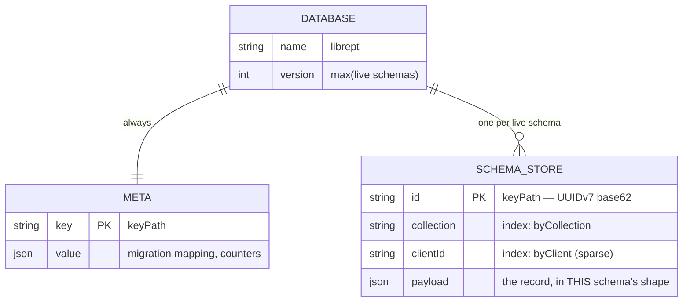
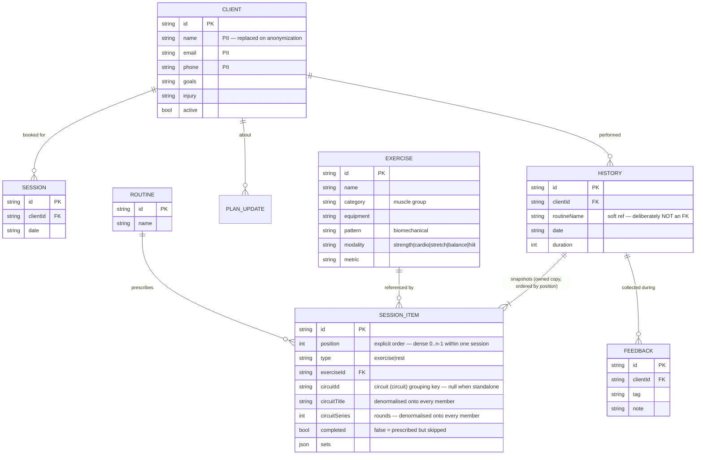
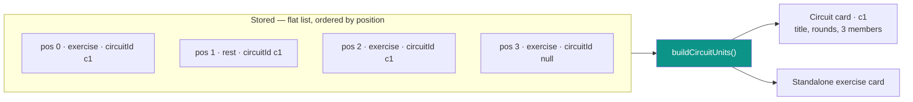

# LibrePT Data Model & Storage Schema

How LibrePT stores a trainer's data, and why it is shaped this way. Design rationale and open
questions live in [TODO §18](../TODO.md); this document is the reference for what exists.

> **Status:** the physical layout below is **built** ([indexedDb.js](../src/data/indexedDb.js)); the
> star-write layer that fills it is **in progress**. The main read/write path still runs through
> `localStorage` via [stateStore.js](../src/data/stateStore.js) until that move lands.

---

## 1. The two version axes

The single most important thing to keep straight — and the one thing never to collapse into one
number:

| Axis | What it identifies | Shape | Where it lives |
| :--- | :--- | :--- | :--- |
| **Behaviour** | Which UI/logic a trainer is using | a named behaviour, selectable in-app | one deployed build carries them all |
| **Data schema** | The shape of a stored record | plain integer major | `schemaVersion`, [migrationSteps.js](../src/data/migrationSteps.js) |

**There are no release tags and no rollback-by-navigation.** One build ships every supported
behaviour concurrently, so switching behaviour is an in-app choice, not a different URL and not a
different deployment. The data schema is the only axis storage is keyed on.

A schema major is bumped **only** when a migration step is added. A "patch" to a schema is either a
migration step or it is nothing.

---

## 2. Physical layout — one database, one store per schema



**One database is a correctness constraint, not a preference.** IndexedDB transactions cannot span
*databases*. Giving each schema its own database would make an atomic star write impossible by
construction — and a phone locking mid-fan-out would leave one schema written and another not.

Store names are `schema2`, `schema3`, … The database `version` is derived from the highest live
schema, so provisioning a schema is the only thing that triggers `onupgradeneeded`. Provisioning is
additive: a retired schema's store is never dropped as a side effect of booting: discarding a bucket
is a deliberate act.

### Indexes, and what they are for

| Index | Key path | Purpose |
| :--- | :--- | :--- |
| `byCollection` | `collection` | Load one collection without scanning the store |
| `byClient` | `clientId` | **Lazy per-client load** — one index hit instead of deserialising every client's history to render one screen |

`byClient` is sparse: records with no owner (the exercise catalog) simply do not appear in it.
`getAllKeys()` walks an index's B-tree and returns keys **without deserialising payloads**, which is
what makes the migration-completeness check (§4) — a set difference over two stores' keys — cheap
rather than a full scan.

---

## 3. Logical record model

The collections, and the references between them. **The reference graph must stay acyclic** — see §4.



Three modelling decisions worth knowing before changing anything here:

- **History owns a frozen copy of the program**, not a reference to a live routine. Editing a routine
  must never rewrite the past. "Copy, not reference" is a *semantic* rule and outlives the storage
  engine: whether the items sit in the history record's payload or in rows of their own, they belong
  to that record and never re-point at a live routine. This makes history the fastest-growing
  collection.
- **`SESSION_ITEM` is a flat typed list**, not a nested circuit container — `circuitId` grouping is
  folded at render (see *Circuits* below), and sequence comes from `position` (see *Ordering* below). The live session and the frozen record use the *same*
  model, so there is no second representation to drift.
- **`routineName` is a soft string reference on purpose.** Making template provenance a hard FK would
  create `history → routine → history`, the first cycle in the graph, and break §4's ordering.

### Ordering — explicit, dense, checkable

**Order is data, carried in the record.** Every `SESSION_ITEM` holds an integer `position`, and
readers **sort by it**. Nothing about how the records are stored is allowed to imply sequence.

The rule the whole scheme rests on:

```
positions(one session's items) === [0, 1, 2, … , n-1]     — dense, unique, gapless
```

**Why explicit at all: the store no longer preserves order for us.** On JSON, sequence rode along
free in an array; the move to IndexedDB (§2, [TODO §18.6](../TODO.md)) retires that. Records are
keyed and indexed, and a key order is not a program order — so unless order is a *field*, a
projection, a per-row store or an import loses it with nothing left to rebuild from. The §4
completeness check would not notice, because every id is still present and only the sequence is
wrong: a scrambled session that passes every integrity test we have. **`position` is therefore a
prerequisite of the engine move, not a follow-up to it.**

Two invariants fall out of density, neither of which any implicit scheme could express:

| Invariant | Check | What it catches |
| :--- | :--- | :--- |
| **Dense and unique** | sorted positions equal `0..n-1` | a dropped item, a duplicated item, a half-applied reorder, a projection that wrote a partial list |
| **Circuit members are contiguous** | per `circuitId`: `max(position) - min(position) + 1 === member count` | a circuit split in two by an item wedged into the middle |

#### Why not a linked list

`nextId` / `prevId` pointers are the more *flexible* representation, and that is the wrong axis to
optimise. Three properties are on offer and no scheme gives all three:

| Scheme | Cheap insert / move | Ordered read | Integrity checkable |
| :--- | :--- | :--- | :--- |
| **Dense `position`** | renumber the tail | index range scan, already sorted | **yes** — `0..n-1` |
| Linked list | 2–3 row writes, no neighbours disturbed | pointer chase, `n` dependent reads | no cheap check |
| Gapped / fractional rank | no renumber | index range scan | no — any distinct set is valid |

- **Reading is the hot path, and a chain cannot be read in one go.** Rendering the clipboard needs
  the whole session in order on every re-render. Positions come back sorted from one index range
  scan; a chain costs `n` *dependent* lookups — each hop must complete before the next key is known,
  so it cannot be batched or parallelised. Inserts, by contrast, happen at human speed: a trainer taps
  "+ Exercise" a handful of times per session.
- **A broken pointer loses the tail, silently.** One bad `nextId` and every item after it is
  unreachable — the session simply ends early, and nothing distinguishes that from a session that
  really was that short. A bad `position` misplaces exactly one item, and the density check names it.
  For the *only copy* of a trainer's records, a failure mode of "lose one item's place" beats "lose
  the rest of the workout".
- **Chains fail in ways with no correct repair.** Corruption yields cycles, forks and orphans;
  deciding which branch is the real one is guesswork. A position list fails as a hole or a duplicate,
  and the repair is a renumber — mechanical, and obviously right.
- **Contiguity stops being a predicate.** `max - min + 1 === count` has no equivalent over a chain;
  verifying a circuit means traversing the whole list and hoping the traversal itself is sound.
- **The flexibility does not pay for itself.** Pointer schemes earn their keep with concurrent
  writers doing frequent reorders on large collections. This is a single-writer, offline-first app
  where a session holds tens of items, and renumbering them is one transaction of `n` puts.

**What would change the decision**: sessions in the thousands of items, or genuine concurrent editing
of one session from two devices. Neither is on the roadmap; if either arrives, fractional ranks — not
a chain — are the next stop, because they keep the ordered read.

**Also rejected: a second `circuitPosition` field.** A member's index inside its circuit is derivable
from `position` and the contiguity invariant, so storing it creates two sources of truth that can
disagree — and their disagreement has no correct resolution. One authoritative field, everything else
derived.

> **Not built yet.** Positions are specified here; today's shapes still order by array index, which
> is exactly the artefact the engine move retires. Shipping it is expand-first (§4): write `position`
> on every item everywhere, then flip readers to sort by it — and it must land **before** items stop
> living in an ordered structure, because after that there is nothing to derive the first positions
> from. Legacy JSON records get theirs assigned once, at migration, from the array order that is still
> intact at that moment. Tracked in [TODO §17.5](../TODO.md).

### Circuits — a grouping key, not a record

There is **no circuit entity**, which is why one does not appear in the diagram above. A circuit is a
run of **consecutive** `SESSION_ITEM`s that share a `circuitId` — exercises *and* the rests between
them — folded into one unit at render time by `buildCircuitUnits`. `circuitId` is a **grouping key
among sibling items, not a foreign key**: it points at no record, so it adds no edge to the reference
graph and cannot introduce the cycle §4 forbids. That is also why the field
appears three times per member rather than once per group:

| Field | On every member | Why it is denormalised |
| :--- | :--- | :--- |
| `circuitId` | the grouping key | the *only* thing that makes an item a member; `null` = standalone |
| `circuitTitle` | the group's name | a member must render its own header without a second lookup |
| `circuitSeries` | round count | a member's `sets` length **is** the round count — one source of truth per item |



**The contiguity is an invariant, not an accident.** Members must occupy consecutive positions or the
fold would split one circuit into two units; `normalizeCircuits()` in
[clipboardEditor.js](../src/modules/clipboard/clipboardEditor.js) pulls members back together on
every edit, and re-stamps the shared `circuitTitle`/`circuitSeries` so denormalised copies cannot
diverge. In a completed history record the order is frozen, so the invariant holds for good. With
explicit positions the invariant stops being a convention the editor upholds and becomes a
**query** — `max(position) - min(position) + 1 === member count` per `circuitId` — so a circuit
broken by anything other than the editor is detectable instead of merely rendering wrong.

**One word, everywhere: circuit.** The feature shipped as a round-counted *circuit* block
(2026-07-16); the UI called it a *superset* from the next day until **2026-07-26**, when the label
was brought back in line with the data. The two were never synonyms anyway — a superset is two
movements back-to-back, a circuit is a round-based block of three or more — and what the model
actually stores is the round-counted one (`circuitSeries` **is** each member's set count), so the
UI was the half that was wrong.

The **stored keys never changed**, which is what made this a UI-and-identifiers rename rather than a
schema major: `circuitId` / `circuitTitle` / `circuitSeries` read the same in a record written a year
ago as in one written today, and no migration was needed. Two compatibility surfaces do carry the old
spelling forward, deliberately and permanently — the `/session/…/superset/{id}` deep-link segment
(links are bookmarked and shared; a URL that once worked must not start erroring) and a persisted
`focusRef.type: "superset"` in a live session cached by an older build (a running timer must not lose
the card it belongs to). Both normalise to `circuit` on arrival.

**Round position is live-only.** The *current* round a trainer is on lives in the active-session
cache as `circuitRounds[circuitId]`, never in a history record — a finished record stores how many
rounds were **prescribed** (`circuitSeries`) and what was **performed** (each member's `sets`), which
is enough to reconstruct the block without storing a cursor into a session that has ended.

---

## 4. Star writes — one domain object, every live schema

The data layer does not migrate a chain (`v2 → v3 → v4`). It **projects**, directly from the live
domain object into every schema that is currently live:


**Why a star and not a chain.** In a chain, lossiness compounds and each step is tested against the
previous step's output rather than against reality. In a star, every projection is computed from the
same source, so error cannot compound and each is independently testable. There are also **no
backward transforms to write** — a "downgrade" is just a projection that was already being written.

### Invariants the star depends on

| Invariant | Why |
| :--- | :--- |
| Projections are **pure and total** | Buckets stay fully re-derivable, so a divergence is repairable by re-projection rather than by restore |
| The fan-out is **one transaction** | A phone locking mid-write cannot leave schemas disagreeing |
| Ids are **stable across projections** | The same logical record is the same key in every store |
| Order is **carried in the record** (`position`), never implied by array index | A projection that re-serialises, or a store that holds items as rows, would otherwise lose sequence silently — every id still present, the session in the wrong order |
| The reference graph is **acyclic** | Migration replays in topological (foreign-key availability) order, never by timestamp — the device clock is not trustworthy |
| Schema changes are **expand-first** | A field's storage ships in every live schema *before* the UI that writes it, so no projection is ever lossy |

### Migration

Migration into a newly live schema is **pre-emptive** (it starts before a trainer opts into anything),
**resumable** (a phone dies mid-way and it picks up), and runs **through the normal write layer** —
`read old record → build domain object → star write` — so there is no second transform to drift.

The `meta` store holds the id mapping, which doubles as the cursor: *present in the mapping* means
*migrated*. Ordinary use therefore **accelerates** migration, because a star write to a not-yet-
migrated record populates the new store and marks it, and migration then skips it.

**Completeness is a query, never a stored flag** — and the query compares **id sets, not counts**:

```
complete(target) ⇔ keys(source store) \ keys(target store) = ∅
```

The target is complete when the source holds **no id the target is missing**. Derived state cannot
drift the way a flag written at the wrong moment can.

**Why not `count(source) === count(mapping)`.** Two counts are independent aggregates over two
stores; nothing ties them element-to-element. One absent source id together with one spurious target
entry — a retried projection that wrote under a fresh id, an imported backup, a fan-out that
committed in one store and not another, a plain bug — yields **equal counts over a hole**, and the
check passes on a bucket that is missing a client. Count equality is only sound under assumptions the
storage layer cannot enforce (no deletes, strict 1:1, no duplicates, no external writes); a set
difference needs none of them, because it compares the actual thing being asserted. This is what the
star-write invariant *"ids are stable across projections"* buys: the same logical record is the same
key in every store, so the sets are directly comparable.

**Containment, not equality.** Ids in the target that the source lacks are **not** an error — a
record created after the target went live legitimately exists only forward. Asserting equality would
fail on healthy data; asserting containment asks the only question that matters: *is anything left
behind?*

**Cheap, and it names the gap.** `getAllKeys()` on each store returns keys from the B-tree without
deserialising a single payload, already sorted ascending, so the comparison is a linear merge that
short-circuits on the first source key with no match. The result is the **list of missing ids**, not
a boolean — which makes the repair a re-projection of exactly those records instead of a full
re-migration.

A store whose migration is incomplete is **not readable**: a crash at 40% must not show a trainer 40%
of their clients.

---

## 5. Deletion, erasure and retention

**There are no hard deletes.** Erasure is **anonymization**: client PII is replaced with an anonymous
token and the execution records stay, so longitudinal analytics survive.

Two consequences that are easy to get wrong:

- **Anonymization fans out like any other write.** If one store keeps the name and another is
  anonymized, the erasure has failed.
- **The suppression list must be applied at import, not only at erasure.** Restoring a pre-erasure
  backup would otherwise resurrect the PII. It is keyed on the stable record id and stores a salted
  hash and nothing else.

---

## 6. Durability

The database holds the **only** copy of a trainer's records — there is no server. So:

- `navigator.storage.persist()` is requested on boot; without it a browser may reclaim IndexedDB under
  storage pressure, and Safari caps script-writable storage for sites unopened for seven days.
- Risk is reported by **measuring the consequence** (quota, persistence) rather than by sniffing for
  private browsing — see [storageDurability.js](../src/data/storageDurability.js).
- The **backup file is the disaster-recovery tier**, and the only recovery path from a write-layer
  bug. Backups export the newest schema's store only (every other store is derived), and old backups
  stay importable indefinitely: readers are retained forever, writers never.

---

## Related

- [TODO §18](../TODO.md) — design rationale, decisions and open questions
- [indexedDb.js](../src/data/indexedDb.js) — the adapter implementing §2
- [recordId.js](../src/modules/common/recordId.js) — UUIDv7 identity
- [storageDurability.js](../src/data/storageDurability.js) — §6
- [PRIVACY.md](../PRIVACY.md) — the GDPR statement §5 serves
