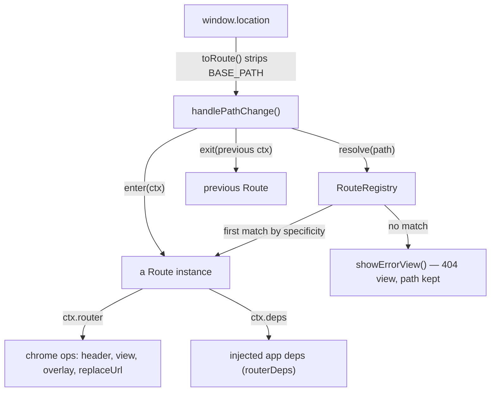

# LibrePT Routing Architecture

**What the URLs are** is [UC5 §4](../use_cases/uc5_session_day_deck_and_deep_links.md) (the route
table) and [README §5](../README.md) (the tour). **How routing works, and how to add to it**, is this
document.

The goal the design serves: *anything a page reload would change should be in the URL.* A trainer who
refreshes mid-session, or reopens a link from a colleague, should land on the screen they were on —
not one level up from it.

---

## 1. The shape of it



| Module | Holds |
| :--- | :--- |
| [routerController.js](../src/controllers/routerController.js) | the browser-facing parts: `BASE_PATH`, `toRoute`/`toUrl`, history writes, `navigateToPath`, and the `ctx.router` facade |
| [routes/route.js](../src/controllers/routes/route.js) | base `Route`: pattern compilation, `match`, `build`, `specificity`, `enter`/`exit` |
| [routes/routeRegistry.js](../src/controllers/routes/routeRegistry.js) | the ordered collection: `register`, `resolve`, `urlFor`, `names` |
| [routes/viewRoute.js](../src/controllers/routes/viewRoute.js) | `ViewRoute`, `RedirectRoute` |
| [routes/sessionRoutes.js](../src/controllers/routes/sessionRoutes.js) | `SessionsDayRoute`, `SessionRoute`, `WorkoutSetupRoute`, `ClientDetailRoute` |
| [routes/routeTable.js](../src/controllers/routes/routeTable.js) | **the data** — every addressable state, as a list |

`handlePathChange()` is the whole dispatcher: resolve, `exit()` the outgoing route, `enter()` the
incoming one. It has no knowledge of any individual route, which is the point — adding an addressable
state means adding a line to `routeTable.js`, not editing a dispatcher.

---

## 2. Why classes instead of a branch per route

Until 2026-07-27 this was a 27-branch `if/else` chain in which *which state a path named* and *what
entering it did* were the same block of code. Three concrete costs, all of which the class hierarchy
removes:

1. **Duplication with no seam.** `overlay.classList.add("hidden")` plus a `setHeaderState()` call was
   copy-pasted into nine branches. It now lives once, in `Route.enter()`.
2. **Order-dependent correctness.** `/session/new` resolved before `/session/:sessionId` *only
   because a human had written it earlier in the chain*. One inserted branch could silently break it.
3. **Untestable in isolation.** Every branch reached straight for `document` and for app functions,
   so nothing could be exercised without booting the whole app in a browser.

The patterns, named:

- **Replace Conditional with Polymorphism** — each route is an object that owns its pattern *and* its
  entry behaviour; the dispatcher became a loop.
- **Template Method** — `Route.enter()` is the fixed skeleton (header → overlay → view). Subclasses
  configure it through constructor fields (`viewId`, `headerActions`, `hidesSessionOverlay`) or extend
  it with `super.enter(ctx)` plus one step of their own. `exit()` is the reverse hook, a no-op by
  default.
- **Chain of Responsibility ordered by a computed key** — see §3.
- **Strategy / dependency injection** — a route never imports a view module and never touches
  `document`. Everything arrives in `ctx` (§4), per AGENT_RULES §5.
- **Reverse routing** — `build()` is the inverse of `match()`, so a URL is spelled from a route name
  plus params and never by hand (§5).

---

## 3. Resolution is by specificity, not registration order

```js
get specificity() {
  return this.literalCount * 1000 + this.segments.length;
}
```

Literal segments dominate, so `/session/new` (two literals) always outranks `/session/:sessionId`
(one literal) no matter where either is registered. Segment count only breaks ties between equally
literal patterns. The registry re-sorts on every `register()`, so **the order of the route table is
for human readability only** — it carries no behaviour.

Inline constraints do the rest of the disambiguation:

```
/sessions/:isoDate([0-9]{4}-[0-9]{2}-[0-9]{2})
/session/:sessionId/client/:clientId/:focusType(exercise|circuit|superset)/:focusId
```

These are not decoration. The date constraint is what stops `/sessions/new` from being swallowed by
the day-deck route, and the `focusType` alternation is what keeps a future sibling segment from being
read as a focus type.

---

## 4. The `ctx` a route receives

```js
ctx = { path, params, route, previousRoute, isBootPass, deps, router }
```

- `params` — decoded pattern params. A malformed `%`-escape makes `match()` return null (an unknown
  route), never a thrown boot.
- `previousRoute` / `isBootPass` — for behaviour that depends on where the user came from, or on this
  being the first resolve after load.
- `deps` — the injected `routerDeps` from [app.js](../src/app.js) (`getState`, `focusSessionsColumn`,
  `openWorkoutSetupModal`, `clientsViewShowDetails`, …).
- `router` — the facade of operations a route may perform: `setHeaderState`, `switchView`,
  `showSessionView`, `showErrorView`, `focusActiveSessionCard`, `hideSessionOverlay`, `replaceUrl`.

Because both of the last two are plain objects handed in per call, a route can be constructed,
matched and entered against stubs with no DOM.

`enter()` **returns the route the user ended up on**, which is not always the one that matched: a
`RedirectRoute` renders its target, and that target is what a later `exit()` must undo. The router
records the returned route as active, which is also what `activeRouteName()` reports.

---

## 5. Invariants

Breaking any of these is a behaviour change, not a refactor.

1. **Patterns never name a version.** They are stored without the base path; `toUrl()` prepends
   `BASE_PATH`, derived from `import.meta.url`. Which release is running is the PT's own
   upgrade/downgrade choice, never a path segment — so the same route resolves wherever the app is
   hosted. See [§16 in TODO.md](../TODO.md).
2. **Patterns are additive.** A URL that once worked must keep working: links are shared and
   bookmarked. `…/superset/{circuitId}` still resolves after the circuit rename, and the address bar
   is upgraded to `/circuit/` on arrival. Removing a pattern is a breaking change that needs a
   redirect left in its place.
3. **An unknown route renders the 404 view and keeps the failed path** in the address bar, offering
   the way home (`#btn-error-home`). It is never silently redirected — a link minted by a newer
   release must say so rather than landing the trainer somewhere else.
4. **URLs are built, not spelled.** Use `urlFor(name, params)` / `route.build(params)`. A hand-written
   path string is what survives a pattern change and turns into a dead link.
5. **No personal data in a path.** Routes carry opaque record ids and closed enums — never names,
   emails or free text. Client records are GDPR Art. 9 health data ([PRIVACY.md](../PRIVACY.md) §3.2),
   and a path segment ends up in history, in screenshots and in shared links.

---

## 6. Adding a route

1. Pick or write the class. A plain view needs no new class — `ViewRoute` with a `viewId` covers it.
   A state that must resolve a record first belongs in `sessionRoutes.js` alongside its siblings.
2. Register it in [routeTable.js](../src/controllers/routes/routeTable.js) with a `name`
   (`area.thing`) and a `pattern`. Put it where it reads best; specificity does the ordering.
3. Navigate to it with `navigateToPath(urlFor("your.name", params))` — never a literal string.
4. Document it: the route table in [UC5 §4](../use_cases/uc5_session_day_deck_and_deep_links.md) and
   the list in [README §5](../README.md).
5. Add the module to `ASSETS` in [cacheManifest.js](../src/sw/cacheManifest.js) and bump `CACHE_NAME`
   if you added a file (`tests/unit/test_project_layout.py` enforces it), plus an
   [INDEX.md](../INDEX.md) row.
6. Cover it: an e2e test that deep-links cold with `page.goto`, asserts the state, **reloads**, and
   asserts it again — reload survival is the whole point — plus a UC5 §6 traceability row.

---

## 7. Related

- [UC5 — Session Day Deck & Deep Links](../use_cases/uc5_session_day_deck_and_deep_links.md) — the route table and the not-found flow
- [UC1 — Gym-Floor Clipboard](../use_cases/uc1_gym_floor_clipboard.md) — the session states the focus and edit routes address
- [DATA_MODEL.md](DATA_MODEL.md) — the records whose ids appear in routes
- [PRIVACY.md](../PRIVACY.md) — why invariant 5 exists
