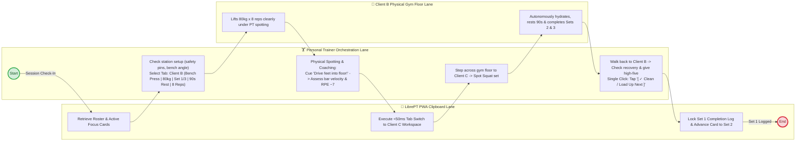
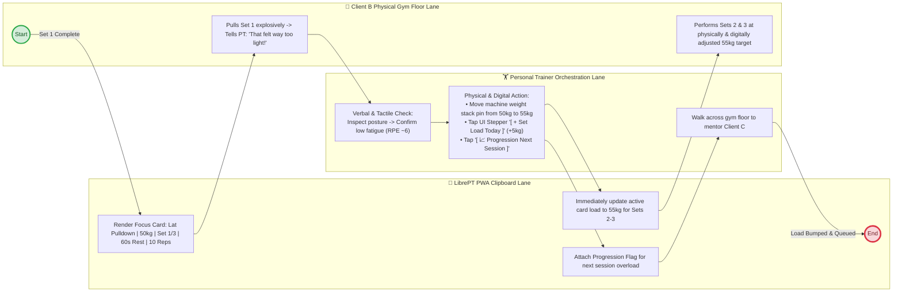
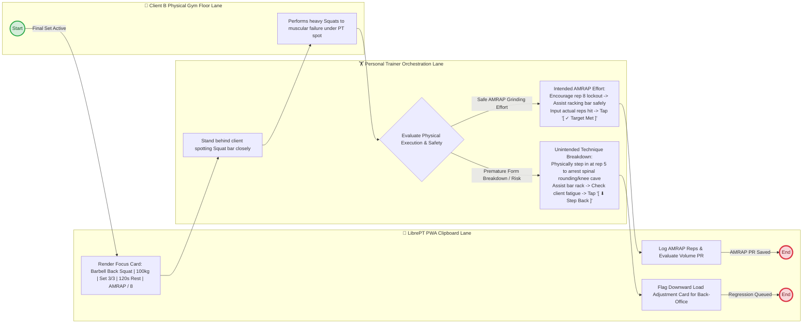
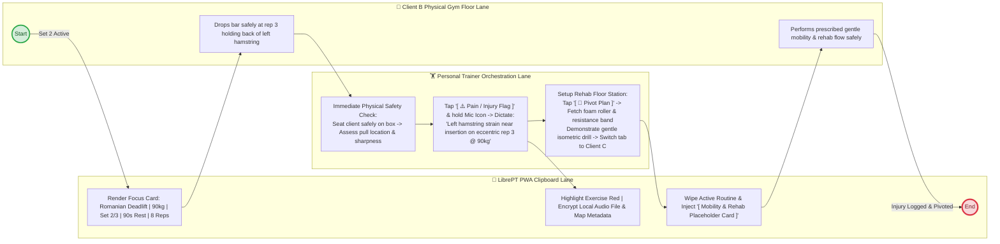

# Use Case 1: PT Session Orchestration & Execution Tracking (PWA Clipboard)

This use case outlines how the Personal Trainer (PT) orchestrates a live training session on the gym floor using low-interaction, single-exercise focus cards and one-tap progression or safety signals.

---

## BPMN Horizontal Multi-Client Gym Floor Scenarios

### Scenario 1: Clean Completion & Multi-Client Floor Rotation
BPMN swimlane choreography modeling physical gym-floor coaching, multi-client attention rotation, and sub-50ms PWA focus card updates.

### Scenario 2: Load Too Easy (Physical Pin Adjustment, In-Session Bump & Future Overload)
BPMN swimlane modeling verbal dialogue on the gym floor, physical cable machine pin adjustments, and split in-session vs. future overload controls.

### Scenario 3: Rep Failure (Physical Spotting: Intended AMRAP vs Premature Form Breakdown)
BPMN swimlane modeling physical barbell spotting, gateway decision logic distinguishing intended AMRAP effort from premature form breakdown, and volume PR tracking.

### Scenario 4: Acute Pain / Injury Report (Physical Intervention, Clinical Audio Note & Rehab Pivot)
BPMN swimlane modeling physical injury intervention, tactile assessment, clinical voice note recording, and setting up rehab equipment on the floor.

---

## Details

### 1. Preconditions
- The session start time is reached.
- Participants have self-subscribed to the class slot via Google Calendar.
- The PT has opened the app on their mobile device.

### 2. Main Flow of Events
1. **Initialize Session**: The PT selects the scheduled session slot from their dashboard.
2. **Attendance Check**: The PT reviews the subscriber list fetched from Google Calendar, confirms attendees, and taps **Launch Clipboard**.
3. **Lock Clipboard Workspace**: The system opens the tracking dashboard, **locking participant tabs** strictly to the checked-in clients.
4. **Session Orchestration & Single-Exercise Tracking**:
   - **Sub-Second Tab Switch**: Tapping a participant's name (`[ Jane ]`, `[ John ]`) swaps the active view in under 50ms.
   - **Primary Focus Card with Foreshadowing**: The screen centers the participant's current active exercise (e.g., *Barbell Back Squat — Target: 80kg × 8 reps*) while displaying a compact **"Up Next" foreshadowing card** below it so the PT can proactively prepare equipment for the next movement.
   - **One-Tap Progression & Safety Signals**: Instead of typing notes on a phone keyboard, the PT has immediate one-tap signal buttons:
     - `[ ⬆ Load Up Next ]`: Client completed the set cleanly; increase target load for their next session.
     - `[ ⬇ Step Back ]`: Client struggled or failed reps; reduce target load for their next session.
     - `[ ⚠️ Pain / Injury Flag ]`: Immediately flag joint pain or acute discomfort on this exercise.
   - **Privacy-First Voice Notes (Auto-Mapped & Local-Only)**: Triggered directly from the feedback UI, voice notes are automatically tagged with the active client and exercise metadata (`clientId`, `exerciseId`). Audio is stored locally on the device and converted asynchronously using **local, on-device transcription libraries only**—ensuring sensitive client medical/physical PII never leaves the local device to external cloud speech APIs.
   - **Reversible Plan Pivot & Session Wipe**: If a client arrives with acute fatigue or equipment is unavailable, the PT taps `[ 🔄 Pivot / Wipe Plan ]`. This wipes the planned routine and immediately injects pre-configured **Generic Placeholder Cards** (`[ Mobility & Core Flow ]`, `[ Machine Superset/Giant Set ]`, `[ Freestyle Block ]`) to maintain effort tracking without typing. This action is fully undoable (`[ ↩ Undo Pivot ]`) and preserved in the audit log for later desk review.
   - **Inline Plan Editing (Focus on the Client)**: For a finer on-the-fly reshape, the PT taps the clipboard's **✎ edit** icon to flip the deck into an editable list — reorder, swap, add/remove exercises, supersets, and rests, all applied to the **live session only**. While editing, the live-session chrome (the active-member tabs and the running timer) **steps aside** and the panel surfaces that client's **personal goals and notes**, so the plan is shaped against the client's aims rather than the clock. Edit mode is a **deep-linkable, reload-proof state**: its URL (`…/edit`) survives a page reload — the PT lands back in the editor, not the live deck — and every change is **persisted on each keystroke**, so nothing is lost if the phone reloads mid-edit. Exit is zero-friction (Done, Esc, or tap-outside). The ⋯ session menu is **context-aware**: while editing it reads **Delete Plan** and clears just that client's exercises (session stays open, still editing); on the live deck it reads **Delete Session** and cancels the whole session. See [UC5 — Deep-Linkable Views](uc5_session_day_deck_and_deep_links.md).
   - **Per-client timer stack**: rest and exercise (work) timers start from the cards and stack on the clipboard, each **labelled with the client's name** + what's being timed, so a trainer running several people at once can tell them apart. There is **one active timer per client** — a start on a still-running timer refuses to reset it (warning flash), while a start on one that has run into overtime resets it (acknowledge blink). At zero a timer does **not** stop at "done": it keeps counting into **negative overtime** (red) with a beep at the crossing. Timers are dismiss-only and **persist across clipboard reloads**.
   - Once an exercise is finished for a participant, the PT taps **Next Exercise** to slide the focus card to their next movement.
5. **Complete Session**: The PT taps **Finish Session**.
6. **Split Database Save**: The system:
   - Splits the group log into individual records.
   - Appends execution histories to client profiles.
   - Creates action cards in the trainer's back-office review deck for any recorded `Load Up`, `Step Back`, or `Pain/Injury` signals.
   - Queues a background sync to send the logged data to the server.

### 3. Alternative Flows
- **Offline Mode**: If internet access is lost on the gym floor, all signals, focus card progressions, and audio recordings are saved locally in browser storage, syncing automatically once a connection is re-established.
