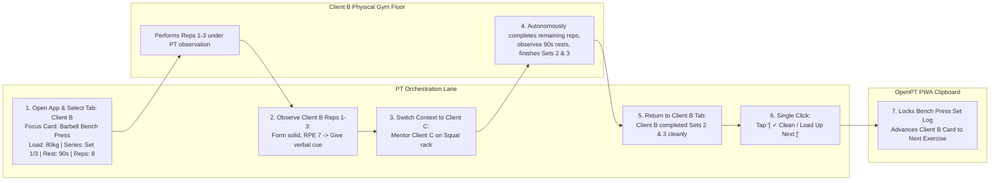
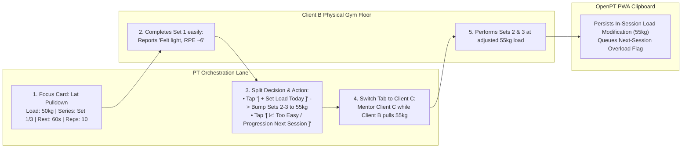
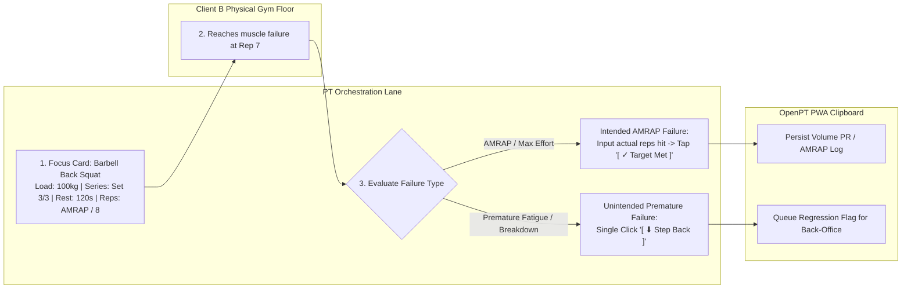
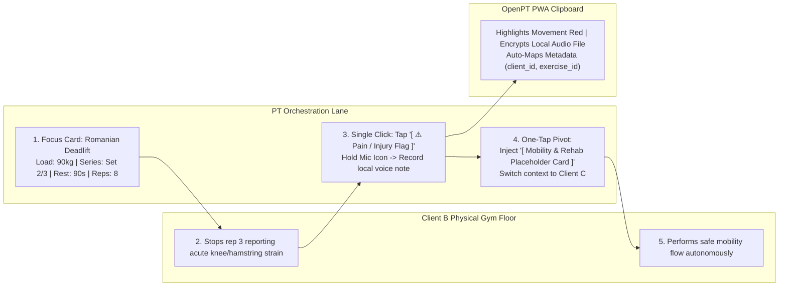

# Use Case 1: PT Session Orchestration & Execution Tracking (PWA Clipboard)

This use case outlines how the Personal Trainer (PT) orchestrates a live training session on the gym floor using low-interaction, single-exercise focus cards and one-tap progression or safety signals.

---

## BPMN Horizontal Multi-Client Gym Floor Scenarios

### Scenario 1: Clean Completion & Multi-Client Rotation (Client B -> Client C -> Return to Client B)
Horizontal flow modeling how the PT opens the app, inspects Client B's Focus Card (`Exercise`, `Load`, `Series`, `Rest`, `Reps`), cues initial reps, rotates attention to Client C while Client B completes remaining sets autonomously, and returns to log a single-click clean completion.

### Scenario 2: Load Too Easy (Split: In-Session Stepper Bump + Future Session Overload)
Horizontal flow showing how the PT adjusts load on the fly when Client B reports low RPE on Set 1, bumping remaining sets today while flagging progression for next week before rotating to Client C.

### Scenario 3: Rep Failure (Intended AMRAP/Max-Reps vs. Unintended Premature Failure)
Horizontal flow modeling how the PT evaluates failure on Client B's final set—distinguishing intentional AMRAP sets from premature technique breakdown.

### Scenario 4: Acute Pain / Injury Report (One-Tap Flag, Local Voice Note & Placeholder Pivot)
Horizontal flow modeling how the PT immediately flags pain on Client B's card, records a privacy-protected local voice note, and pivots Client B to a generic placeholder flow before rotating to Client C.

---

## Details

### 1. Preconditions
- The session start time is reached.
- Participants have self-subscribed to the class slot via Google Calendar.
- The PT has opened the app on their mobile device.

### 2. Main Flow of Events
1. **Initialize Session**: The PT selects the scheduled session slot from their dashboard.
2. **Attendance Check**: The PT reviews the subscriber list fetched from Google Calendar, confirms attendees, and taps **Launch Clipboard**.
3. **Lock Clipboard Workspace**: The system opens the tracking dashboard, **locking participant tabs** strictly to the checked-in clients.
4. **Session Orchestration & Single-Exercise Tracking**:
   - **Sub-Second Tab Switch**: Tapping a participant's name (`[ Jane ]`, `[ John ]`) swaps the active view in under 50ms.
   - **Primary Focus Card with Foreshadowing**: The screen centers the participant's current active exercise (e.g., *Barbell Back Squat — Target: 80kg × 8 reps*) while displaying a compact **"Up Next" foreshadowing card** below it so the PT can proactively prepare equipment for the next movement.
   - **One-Tap Progression & Safety Signals**: Instead of typing notes on a phone keyboard, the PT has immediate one-tap signal buttons:
     - `[ ⬆ Load Up Next ]`: Client completed the set cleanly; increase target load for their next session.
     - `[ ⬇ Step Back ]`: Client struggled or failed reps; reduce target load for their next session.
     - `[ ⚠️ Pain / Injury Flag ]`: Immediately flag joint pain or acute discomfort on this exercise.
   - **Privacy-First Voice Notes (Auto-Mapped & Local-Only)**: Triggered directly from the feedback UI, voice notes are automatically tagged with the active client and exercise metadata (`clientId`, `exerciseId`). Audio is stored locally on the device and converted asynchronously using **local, on-device transcription libraries only**—ensuring sensitive client medical/physical PII never leaves the local device to external cloud speech APIs.
   - **Reversible Plan Pivot & Session Wipe**: If a client arrives with acute fatigue or equipment is unavailable, the PT taps `[ 🔄 Pivot / Wipe Plan ]`. This wipes the planned routine and immediately injects pre-configured **Generic Placeholder Cards** (`[ Mobility & Core Flow ]`, `[ Machine Circuit ]`, `[ Freestyle Block ]`) to maintain effort tracking without typing. This action is fully undoable (`[ ↩ Undo Pivot ]`) and preserved in the audit log for later desk review.
   - Once an exercise is finished for a participant, the PT taps **Next Exercise** to slide the focus card to their next movement.
5. **Complete Session**: The PT taps **Finish Session**.
6. **Split Database Save**: The system:
   - Splits the group log into individual records.
   - Appends execution histories to client profiles.
   - Creates action cards in the trainer's back-office review deck for any recorded `Load Up`, `Step Back`, or `Pain/Injury` signals.
   - Queues a background sync to send the logged data to the server.

### 3. Alternative Flows
- **Offline Mode**: If internet access is lost on the gym floor, all signals, focus card progressions, and audio recordings are saved locally in browser storage, syncing automatically once a connection is re-established.
