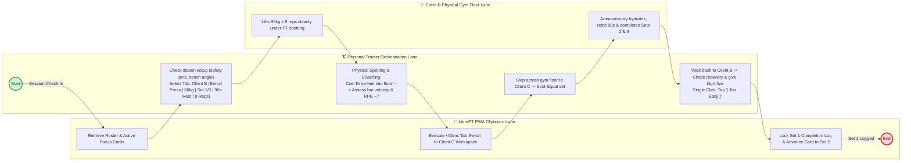
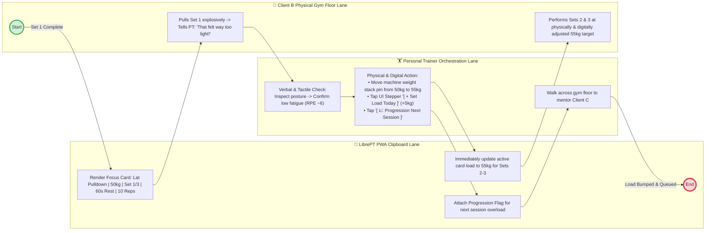
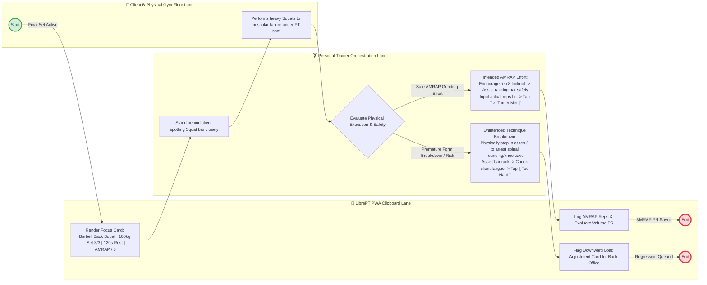
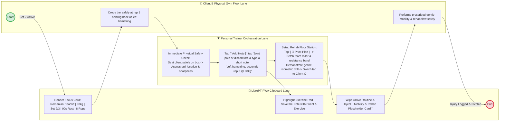

# Use Case 1: PT Session Orchestration & Execution Tracking (PWA Clipboard)

This use case outlines how the Personal Trainer (PT) orchestrates a live training session on the gym floor using low-interaction, single-exercise focus cards and one-tap progression or safety signals.

---

## BPMN Horizontal Multi-Client Gym Floor Scenarios

### Scenario 1: Clean Completion & Multi-Client Floor Rotation
BPMN swimlane choreography modeling physical gym-floor coaching, multi-client attention rotation, and sub-50ms PWA focus card updates.

```mermaid
graph LR
    subgraph PWALane ["📱 LibrePT PWA Clipboard Lane"]
        PWA1["Retrieve Roster & Active Focus Cards"]
        PWA2["Execute <50ms Tab Switch to Client C Workspace"]
        PWA3["Lock Set 1 Completion Log & Advance Card to Set 2"]
        End1(("End"))
    end

    subgraph TrainerLane ["🏋️ Personal Trainer Orchestration Lane"]
        Start1(("Start"))
        T1["Check station setup (safety pins, bench angle)<br/>Select Tab: Client B (Bench Press | 80kg | Set 1/3 | 90s Rest | 8 Reps)"]
        T2["Physical Spotting & Coaching:<br/>Cue 'Drive feet into floor!' -> Assess bar velocity & RPE ~7"]
        T3["Step across gym floor to Client C -> Spot Squat set"]
        T4["Walk back to Client B -> Check recovery & give high-five<br/>Single Click: Tap '[ Too Easy ]'"]
    end

    subgraph ClientLane ["💪 Client B Physical Gym Floor Lane"]
        CB1["Lifts 80kg x 8 reps cleanly under PT spotting"]
        CB2["Autonomously hydrates, rests 90s & completes Sets 2 & 3"]
    end

    Start1 -- "Session Check-In" --> PWA1
    PWA1 --> T1
    T1 --> CB1
    CB1 --> T2
    T2 --> PWA2
    PWA2 --> T3
    T3 --> CB2
    CB2 --> T4
    T4 --> PWA3
    PWA3 -- "Set 1 Logged" --> End1

    style Start1 fill:#d4edda,stroke:#28a745,stroke-width:3px,color:#155724
    style End1 fill:#f8d7da,stroke:#dc3545,stroke-width:4px,color:#721c24
```

### Scenario 2: Load Too Easy (Physical Pin Adjustment, In-Session Bump & Future Overload)
BPMN swimlane modeling verbal dialogue on the gym floor, physical cable machine pin adjustments, and split in-session vs. future overload controls.

```mermaid
graph LR
    subgraph PWALane ["📱 LibrePT PWA Clipboard Lane"]
        PWA21["Render Focus Card: Lat Pulldown | 50kg | Set 1/3 | 60s Rest | 10 Reps"]
        PWA22["Immediately update active card load to 55kg for Sets 2-3"]
        PWA23["Attach Progression Flag for next session overload"]
        End2(("End"))
    end

    subgraph TrainerLane ["🏋️ Personal Trainer Orchestration Lane"]
        T21["Verbal & Tactile Check:<br/>Inspect posture -> Confirm low fatigue (RPE ~6)"]
        T22["Physical & Digital Action:<br/>• Move machine weight stack pin from 50kg to 55kg<br/>• Tap UI Stepper '[ + Set Load Today ]' (+5kg)<br/>• Tap '[ 📈 Progression Next Session ]'"]
        T23["Walk across gym floor to mentor Client C"]
    end

    subgraph ClientLane ["💪 Client B Physical Gym Floor Lane"]
        Start2(("Start"))
        CB21["Pulls Set 1 explosively -> Tells PT: 'That felt way too light!'"]
        CB22["Performs Sets 2 & 3 at physically & digitally adjusted 55kg target"]
    end

    Start2 -- "Set 1 Complete" --> PWA21
    PWA21 --> CB21
    CB21 --> T21
    T21 --> T22
    T22 --> PWA22
    T22 --> PWA23
    PWA22 --> CB22
    PWA23 --> T23
    T23 -- "Load Bumped & Queued" --> End2

    style Start2 fill:#d4edda,stroke:#28a745,stroke-width:3px,color:#155724
    style End2 fill:#f8d7da,stroke:#dc3545,stroke-width:4px,color:#721c24
```

### Scenario 3: Rep Failure (Physical Spotting: Intended AMRAP vs Premature Form Breakdown)
BPMN swimlane modeling physical barbell spotting, gateway decision logic distinguishing intended AMRAP effort from premature form breakdown, and volume PR tracking.

```mermaid
graph LR
    subgraph PWALane ["📱 LibrePT PWA Clipboard Lane"]
        PWA31["Render Focus Card: Barbell Back Squat | 100kg | Set 3/3 | 120s Rest | AMRAP / 8"]
        PWA32["Log AMRAP Reps & Evaluate Volume PR"]
        PWA33["Flag Downward Load Adjustment Card for Back-Office"]
        End3A(("End"))
        End3B(("End"))
    end

    subgraph TrainerLane ["🏋️ Personal Trainer Orchestration Lane"]
        T31["Stand behind client spotting Squat bar closely"]
        GW3{"Evaluate Physical Execution & Safety"}
        T3Intended["Intended AMRAP Effort:<br/>Encourage rep 8 lockout -> Assist racking bar safely<br/>Input actual reps hit -> Tap '[ ✓ Target Met ]'"]
        T3Unintended["Unintended Technique Breakdown:<br/>Physically step in at rep 5 to arrest spinal rounding/knee cave<br/>Assist bar rack -> Check client fatigue -> Tap '[ Too Hard ]'"]
    end

    subgraph ClientLane ["💪 Client B Physical Gym Floor Lane"]
        Start3(("Start"))
        CB31["Performs heavy Squats to muscular failure under PT spot"]
    end

    Start3 -- "Final Set Active" --> PWA31
    PWA31 --> T31
    T31 --> CB31
    CB31 --> GW3
    GW3 -- "Safe AMRAP Grinding Effort" --> T3Intended
    T3Intended --> PWA32
    PWA32 -- "AMRAP PR Saved" --> End3A
    GW3 -- "Premature Form Breakdown / Risk" --> T3Unintended
    T3Unintended --> PWA33
    PWA33 -- "Regression Queued" --> End3B

    style Start3 fill:#d4edda,stroke:#28a745,stroke-width:3px,color:#155724
    style End3A fill:#f8d7da,stroke:#dc3545,stroke-width:4px,color:#721c24
    style End3B fill:#f8d7da,stroke:#dc3545,stroke-width:4px,color:#721c24
```

### Scenario 4: Acute Pain / Injury Report (Physical Intervention, Typed Note & Rehab Pivot)
BPMN swimlane modeling physical injury intervention, tactile assessment, a short typed note, and setting up rehab equipment on the floor.

```mermaid
graph LR
    subgraph PWALane ["📱 LibrePT PWA Clipboard Lane"]
        PWA41["Render Focus Card: Romanian Deadlift | 90kg | Set 2/3 | 90s Rest | 8 Reps"]
        PWA42["Highlight Exercise Red | Save the Note with Client & Exercise"]
        PWA43["Wipe Active Routine & Inject '[ Mobility & Rehab Placeholder Card ]'"]
        End4(("End"))
    end

    subgraph TrainerLane ["🏋️ Personal Trainer Orchestration Lane"]
        T41["Immediate Physical Safety Check:<br/>Seat client safely on box -> Assess pull location & sharpness"]
        T42["Tap '[ Add Note ]', tag 'Joint pain or discomfort' & type a short note:<br/>'Left hamstring, eccentric rep 3 @ 90kg'"]
        T43["Setup Rehab Floor Station:<br/>Tap '[ 🔄 Pivot Plan ]' -> Fetch foam roller & resistance band<br/>Demonstrate gentle isometric drill -> Switch tab to Client C"]
    end

    subgraph ClientLane ["💪 Client B Physical Gym Floor Lane"]
        Start4(("Start"))
        CB41["Drops bar safely at rep 3 holding back of left hamstring"]
        CB42["Performs prescribed gentle mobility & rehab flow safely"]
    end

    Start4 -- "Set 2 Active" --> PWA41
    PWA41 --> CB41
    CB41 --> T41
    T41 --> T42
    T42 --> PWA42
    T42 --> T43
    T43 --> PWA43
    PWA43 --> CB42
    CB42 -- "Injury Logged & Pivoted" --> End4

    style Start4 fill:#d4edda,stroke:#28a745,stroke-width:3px,color:#155724
    style End4 fill:#f8d7da,stroke:#dc3545,stroke-width:4px,color:#721c24
```

---

## Details

### 1. Preconditions
- The session start time is reached.
- The participants are on the session: assigned by the PT, or added by answering the session's invitation.
- The PT has opened the app on their mobile device.

### 2. Main Flow of Events
1. **Initialize Session**: The PT selects the scheduled session slot from their dashboard.
2. **Open the Clipboard**: The PT taps the session card, which opens the clipboard with the session's participants.
3. **Lock Clipboard Workspace**: The system opens the tracking dashboard, **locking participant tabs** strictly to the checked-in clients.
4. **Session Orchestration & Single-Exercise Tracking**:
   - **Sub-Second Tab Switch**: Tapping a participant's name (`[ Jane ]`, `[ John ]`) swaps the active view in under 50ms.
   - **Primary Focus Card with Foreshadowing**: The screen centers the participant's current active exercise (e.g., *Barbell Back Squat — Target: 80kg × 8 reps*) while displaying a compact **"Up Next" foreshadowing card** below it so the PT can proactively prepare equipment for the next movement.
   - **One-Tap Progression & Safety Signals**: Instead of typing notes on a phone keyboard, the PT has one-tap signal buttons on the exercise card:
     - **Too Easy**: Client completed the set cleanly; a note for the trainer that the load can go up next time.
     - **Too Hard**: Client struggled or failed reps; a note for the trainer that the load should come down. The app never changes a load itself: the trainer sets it when building the next plan.
     - **Add Note** opens the feedback dialog, where the tag **Joint pain or discomfort** flags pain on this exercise.
   - **Typed feedback notes, no voice**: the feedback dialog takes a tag and a short typed note, attached to the active client and exercise. **The app never records audio** — ruled 2026-09-27 for privacy: a microphone in a gym records everyone near it. A mock recorder that once stood here wrote a sentence nobody had said into the client's record, so it was removed, not finished.
   - **Reversible Plan Pivot & Session Wipe**: If a client arrives with acute fatigue or equipment is unavailable, the PT taps `[ 🔄 Pivot / Wipe Plan ]`. This wipes the planned routine and immediately injects pre-configured **Generic Placeholder Cards** (`[ Mobility & Core Flow ]`, `[ Machine Circuit/Giant Set ]`, `[ Freestyle Block ]`) to maintain effort tracking without typing. This action is fully undoable (`[ ↩ Undo Pivot ]`) and preserved in the audit log for later desk review.
   - **Inline Plan Editing (Focus on the Client)**: For a finer on-the-fly reshape, the PT taps the clipboard's **✎ edit** icon to flip the deck into an editable list — reorder, swap, add/remove exercises, circuits, and rests, all applied to the **live session only**. While editing, the live-session chrome (the active-member tabs and the running timer) **steps aside** and the panel surfaces that client's **personal goals and notes**, so the plan is shaped against the client's aims rather than the clock. Edit mode is a **deep-linkable, reload-proof state**: its URL (`…/edit`) survives a page reload — the PT lands back in the editor, not the live deck — and every change is **persisted on each keystroke**, so nothing is lost if the phone reloads mid-edit. Exit is zero-friction (Done, Esc, or tap-outside). **The item just touched is never lost in the list**: inserting an exercise, circuit or rest — from the live deck's fast-adjust bar, an insert bar, or the catalog — re-renders the whole plan, so the new row is highlighted, scrolled into view and given the caret, ready to type — **no badge**: a blank row holding the caret already announces itself, and a tag beside it is noise on a narrow row. A row the catalog filled in takes no focus and reads as ordinary, so it *does* carry a label — **New** when injected, **Swapped** when a movement was retargeted in place. The call-out is **one-shot** — the next action moves it, so a highlight never outlives the moment it describes. Each exercise row also carries a **📖 catalog button** next to its name combobox, opening the filtered taxonomy picker for that row and swapping the movement **in place** — same slot, same sets, same logs (see [UC6](uc6_exercise_taxonomy_and_picker.md)). The ⋯ session menu is **context-aware**: while editing it reads **Delete Plan** and clears just that client's exercises (session stays open, still editing); on the live deck it reads **Delete Session** and takes the slot **off the schedule for good** — the card leaves the dashboard, its logged sets and feedback are discarded, but **each participant's plan is kept as an Unscheduled plan** so the programming can be re-run on another day (it surfaces in the notification feed's *Unscheduled plans* item). Above it, **Mark session as cancelled** keeps the slot **on the board, marked Cancelled** — muted text, an edge in the theme's warning colour, and the word itself, so the meaning is not in colour alone — with the plans and logged sets handled exactly as Delete handles them. A cancelled card has no countdown, no warnings and no edit control, and tapping it opens nothing. Like Delete, it names the session in its question and asks a started session to be slid rather than tapped; it is not offered while editing or for a plan with no booked slot. The same delete is offered from the **off-schedule dialog** raised when a session is started well outside its slot: hours late, the honest answer is often that the session never ran at all. **Completing is not offered while editing**: *Complete Workout Session* logs an execution to history, which is meaningless mid-edit, so the whole finish bar steps aside and **Done** is the only exit — it returns on exit from edit mode. The same applies to a **planning-mode programme**, which was never run and so is never completable. See [UC5 — Deep-Linkable Views](uc5_session_day_deck_and_deep_links.md).
   - **Per-client timer stack**: rest and exercise (work) timers start from the cards and stack on the clipboard, each **labelled with the client's name** + what's being timed, so a trainer running several people at once can tell them apart. There is **one active timer per client** — a start on a still-running timer refuses to reset it (warning flash), while a start on one that has run into overtime resets it (acknowledge blink). At zero a timer does **not** stop at "done": it keeps counting into **negative overtime** (red) with a beep at the crossing. Timers are dismiss-only and **persist across clipboard reloads**.
   - Once an exercise is finished for a participant, the PT taps the next card in the deck to bring that movement into focus.
5. **Complete Session**: The PT taps **Complete Workout Session**.
6. **Split Database Save**: The system:
   - Splits the group log into individual records.
   - Appends execution histories to client profiles.
   - Creates action cards in the trainer's back-office review deck for any recorded *Too Easy*, *Too Hard* or pain signals. (Each card is written when the signal is given, so it is already on the review screen.)
   - Queues a background sync to send the logged data to the server.

### 3. Alternative Flows
- **Offline Mode**: If internet access is lost on the gym floor, all signals, focus card progressions, and typed notes are saved locally in browser storage, syncing automatically once a connection is re-established.
- **Session starts off schedule**: Gyms run late — the previous group overruns, a client turns up twenty minutes after the hour. When **Start** is tapped more than **±15 minutes** from the scheduled slot, the session starts *immediately* (nothing waits on a dialog) and the PT is then **offered the schedule**, prefilled with the whole slot shifted onto the clock and keeping its planned length. Accepting moves the slot on the dashboard card and on the session record, so history and the day's timeline record when the session actually ran; declining (**Keep scheduled**, Esc, or ✕) changes nothing. A session begun *after* its scheduled end has no countdown left to run, so its clock **counts up from the actual start** rather than opening on an overrun it never had.

## Spec ↔ test traceability

| Promise | Where it is held |
| :--- | :--- |
| A session card opens the clipboard, with a tab for each checked-in client | [test_gym_floor_flow.py](../tests/e2e/test_gym_floor_flow.py) |
| *Too Easy* / *Too Hard*: one tap logs, a second tap undoes, the opposite swaps | [test_clipboard_quick_signals.py](../tests/medium/test_clipboard_quick_signals.py) |
| A typed note with a tag, attached to the client and the exercise; no microphone | [test_gym_floor_flow.py](../tests/e2e/test_gym_floor_flow.py) |
| A note can be kept on the client's record, and waits in the editor for the next plan | [test_gym_note_kept_on_record.py](../tests/e2e/test_gym_note_kept_on_record.py) |
| A signal and its note wait on the review screen, after a reload too | [test_gym_note_kept_on_record.py](../tests/e2e/test_gym_note_kept_on_record.py) |
| Edit mode has its own address and survives a reload | [test_edit_mode_deeplink_reload.py](../tests/e2e/test_edit_mode_deeplink_reload.py) |
| Edit mode hides the tabs and the timer and shows the client's goals and notes | [test_clipboard_edit_mode.py](../tests/medium/test_clipboard_edit_mode.py) |
| *Delete Plan* while editing clears the exercises and keeps the session | [test_clipboard_edit_mode.py](../tests/medium/test_clipboard_edit_mode.py) |
| *Complete Workout Session* is not offered while editing | [test_clipboard_complete_action.py](../tests/medium/test_clipboard_complete_action.py) |
| Deleting a session keeps each client's plan as an unscheduled plan (tested from the off-schedule dialog) | [test_session_start_time_adjust.py](../tests/e2e/test_session_start_time_adjust.py) |
| Timers: labelled, one per client, overtime, reset only in overtime, kept over a reload | [test_timer_stack.py](../tests/e2e/test_timer_stack.py) |
| A timer leaves only by ✕, and sounds once when it crosses zero, not again after a reload | [test_timer_stack.py](../tests/e2e/test_timer_stack.py) |
| Offline: the app opens, a saved address opens, and a note logged offline is kept | [test_offline_gym_floor.py](../tests/e2e/test_offline_gym_floor.py) |
| Offline: the header says so, and a sync attempt reports the server unreachable | [test_offline_cached_signal.py](../tests/medium/test_offline_cached_signal.py) |
| A start off schedule offers the new time; declining changes nothing; counts up after the end | [test_session_start_time_adjust.py](../tests/e2e/test_session_start_time_adjust.py) |
| Completing stamps the booking completed, with its duration | [test_session_status_line.py](../tests/e2e/test_session_status_line.py) |
| Plan pivot and placeholder cards | **Not built** — nothing in `src/` implements them; the question is open in TODO.md. |
