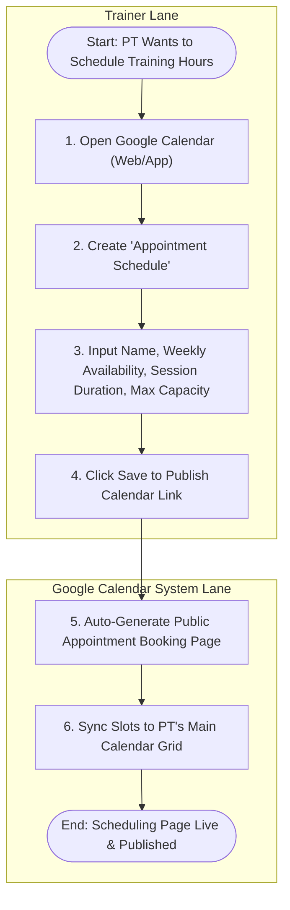

# Use Case 1: Trainer Publishes Repeatable Group Slots (via Google Calendar)

This use case describes how the Personal Trainer (PT) schedules and publishes training slots directly within their Google Calendar interface, making them available for client self-booking.

---

## Process Flow Diagram

---

## Details

### 1. Preconditions
- The PT has a Google Workspace or Google One account that supports the **Appointment Schedules** feature.

### 2. Main Flow of Events
1. **Access Calendar UI**: The PT opens Google Calendar on their computer or mobile device.
2. **Launch Setup**: The PT clicks the **Create** button and selects **Appointment Schedule**.
3. **Define Slot Configuration**: The PT configures the training slot parameters:
   - **Title**: e.g., "Group Strength & Conditioning (Max 4)"
   - **Appointment Duration**: e.g., "60 minutes"
   - **General Availability**: e.g., "Mondays and Wednesdays, 8:00 AM - 12:00 PM"
   - **Booking Window**: e.g., "Up to 30 days in advance"
   - **Maximum Booking Capacity per Slot**: Set guest limit to 4.
4. **Publish**: The PT saves the setup. Google Calendar generates a unique public booking page URL (e.g., `calendar.app.google/xxxx`).
5. **API Accessibility**: Google Calendar updates the PT's calendar grid. These slot events are now readable via the Google Calendar API.
