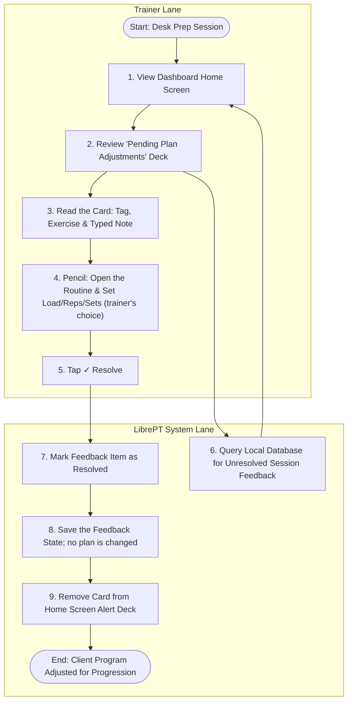

# Use Case 2: Asynchronous Program Updates & Client Progression

This use case describes the desk-side workflow where the Personal Trainer (PT) reviews exercise feedback and typed notes logged during live sessions, and adjusts client routines and plans with their own judgement.

**The app sets no training targets** (ruled 2026-10-03, Simon). It shows each signal and the note typed with it; the trainer, the expert, decides what changes and enters an exercise's parameters when building the plan. An "Apply Program Adjustment" dialog that proposed a load from the last session and wrote it into the routine was removed: it guessed, and for a session built without a routine it wrote nothing while clearing the signal.

---

## Process Flow Diagram

---

## Details

### 1. Preconditions
- The PT has completed group or individual sessions.
- Granular exercise feedback tags or short typed notes were recorded during those sessions.

### 2. Main Flow of Events
1. **Access Back-Office**: The PT opens the LibrePT app on their computer or tablet.
2. **Review Feedback Deck**: The system queries the database and displays the **Pending Plan Adjustments** deck on the home screen.
3. **Analyze Alert**: The PT reads an alert card:
   - e.g., *"Jane Doe - Barbell Back Squat - Form Break"*
   - The card shows the note typed in the gym: *"Lower back tight on set 3, limited depth."*
4. **Modify Template (the trainer's decision)**: The PT taps the card's pencil to open the routine that holds the exercise, and changes what they judge right there — a lower load, a note, another movement. A session built without a routine has no pencil; its next plan is set when it is built.
5. **Resolve Alert**: The PT taps **✓ Resolve** on the card.
6. **Save Changes**: The system marks the feedback item as resolved and removes the card. Resolving changes no plan.

### 3. Alternative Flows
- **Keep Alert Pending**: The PT leaves the card; it waits until they resolve it.

## Spec ↔ test traceability

| Promise | Where it is held |
| :--- | :--- |
| The review screen lists every unresolved signal, with a count | [test_plan_adjustments.py](../tests/medium/test_plan_adjustments.py) |
| One tap on ✓ resolves the card and changes no plan | [test_plan_adjustments.py](../tests/medium/test_plan_adjustments.py) |
| The note typed on the floor is on the card | [test_plan_adjustments.py](../tests/medium/test_plan_adjustments.py), [test_gym_note_kept_on_record.py](../tests/e2e/test_gym_note_kept_on_record.py) |
| A signal with no routine behind it has no pencil | [test_plan_adjustments.py](../tests/medium/test_plan_adjustments.py) |
| The tag reads in the trainer's language | [test_plan_adjustments.py](../tests/medium/test_plan_adjustments.py) |
| Resolving the last card empties the drawer at once | [test_views_follow_their_data.py](../tests/e2e/test_views_follow_their_data.py) |
