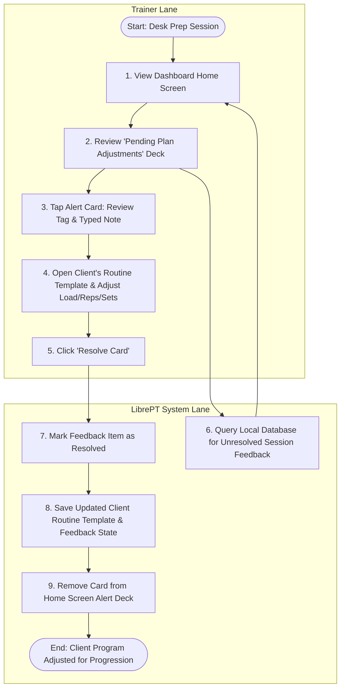

# Use Case 2: Asynchronous Program Updates & Client Progression

This use case describes the desk-side workflow where the Personal Trainer (PT) reviews exercise feedback and typed notes logged during live sessions to adjust client routines and plan future progressive overload trajectories asynchronously.

---

## Process Flow Diagram

---

## Details

### 1. Preconditions
- The PT has completed group or individual sessions.
- Granular exercise feedback tags or short typed notes were recorded during those sessions.

### 2. Main Flow of Events
1. **Access Back-Office**: The PT opens the LibrePT app on their computer or tablet.
2. **Review Feedback Deck**: The system queries the database and displays the **Pending Plan Adjustments** deck on the home screen.
3. **Analyze Alert**: The PT reviews an alert card:
   - e.g., *"Jane Doe - Barbell Back Squat - Form Break (Depth Alert)"*
   - The dialog shows the note typed in the gym: *"Lower back tight on set 3, limited depth."*
4. **Modify Template**: The PT clicks the card to jump into Jane's program template. They:
   - Lower the squat target weight by 5kg.
   - Insert a custom note: *"Focus on deep squats during warm-up; monitor depth."*
5. **Resolve Alert**: The PT clicks **Resolve Alert** on the card.
6. **Save Changes**: The system:
   - Updates Jane's template in the database.
   - Marks the feedback item as resolved.
   - Removes the card from the dashboard deck.

### 3. Alternative Flows
- **Keep Alert Pending**: The PT can close the detail panel without resolving, keeping the card in the "Adjustments Needed" queue until they have time to re-evaluate.
- **Dismiss Alert**: If the feedback was a minor one-off notice, the PT can click **Dismiss** to archive the record without updating the client's template.

## Spec ↔ test traceability

| Promise | Where it is held |
| :--- | :--- |
| The review screen lists every unresolved signal, with a count | [test_plan_adjustments.py](../tests/medium/test_plan_adjustments.py) |
| The dialog opens with the tag in words, the note, and a suggested target | [test_plan_adjustments.py](../tests/medium/test_plan_adjustments.py) |
| *Apply & Resolve* writes the typed target into the plan and resolves the card | [test_plan_adjustments.py](../tests/medium/test_plan_adjustments.py) |
| *Swap* puts another movement in the same place, prescription unchanged | [test_plan_adjustments.py](../tests/medium/test_plan_adjustments.py) |
| *Dismiss* resolves the card and leaves the plan alone | [test_plan_adjustments.py](../tests/medium/test_plan_adjustments.py) |
| Closing without a decision (Cancel, ✕, Esc) keeps the card waiting | [test_plan_adjustments.py](../tests/medium/test_plan_adjustments.py) |
| Resolving the last card empties the drawer at once | [test_views_follow_their_data.py](../tests/e2e/test_views_follow_their_data.py) |
| The dialog is in the trainer's language | [test_adjustment_dialog_language.py](../tests/e2e/test_adjustment_dialog_language.py) |
| A note typed on the floor is on the card's dialog at the desk | [test_gym_note_kept_on_record.py](../tests/e2e/test_gym_note_kept_on_record.py) |
