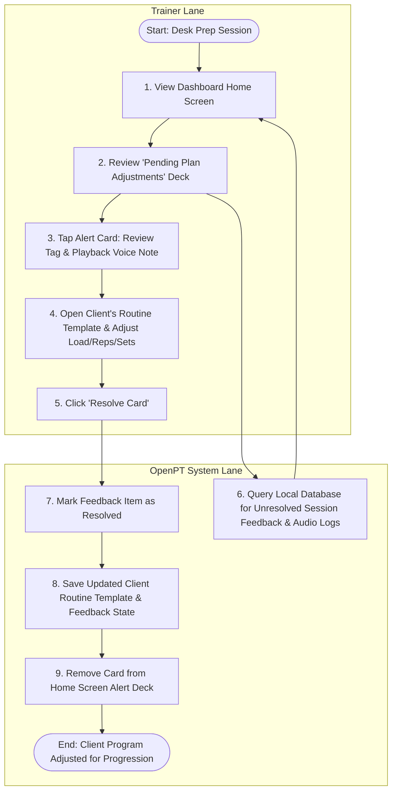

# Use Case 4: Asynchronous Program Updates & Client Progression

This use case describes the desk-side workflow where the Personal Trainer (PT) reviews exercise feedback and voice notes logged during live sessions to adjust client routines and plan future progressive overload trajectories asynchronously.

---

## Process Flow Diagram

---

## Details

### 1. Preconditions
- The PT has completed group or individual sessions.
- Granular exercise feedback tags or on-the-fly voice notes were recorded during those sessions.

### 2. Main Flow of Events
1. **Access Back-Office**: The PT opens the OpenPT app on their computer or tablet.
2. **Review Feedback Deck**: The system queries the database and displays the **Pending Plan Adjustments** deck on the home screen.
3. **Analyze Alert**: The PT reviews an alert card:
   - e.g., *"Jane Doe - Barbell Back Squat - Form Break (Depth Alert)"*
   - The card includes a playback button for a 5-second audio note recorded in the gym: *"Jane felt slight lower back tightness on set 3, so we limited depth. Drop load by 5kg next week and focus on hip mobility warm-ups."*
4. **Modify Template**: The PT clicks the card to jump into Jane's program template. They:
   - Lower the squat target weight by 5kg.
   - Insert a custom note: *"Focus on deep squats during warm-up; monitor depth."*
5. **Resolve Alert**: The PT clicks **Resolve Alert** on the card.
6. **Save Changes**: The system:
   - Updates Jane's template in the database.
   - Marks the feedback item as resolved.
   - Removes the card from the dashboard deck.

### 3. Alternative Flows
- **Keep Alert Pending**: The PT can close the detail panel without resolving, keeping the card in the "Adjustments Needed" queue until they have time to re-evaluate.
- **Dismiss Alert**: If the feedback was a minor one-off notice, the PT can click **Dismiss** to archive the record without updating the client's template.
