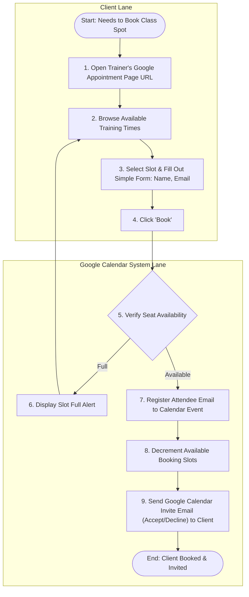

# Use Case 4: Client Self-Subscribes to a Session (via Google Calendar)

This use case describes how clients book their training slots directly through the trainer's Google-hosted booking page, receiving automated email invitations.

---

## Process Flow Diagram

---

## Details

### 1. Preconditions
- The PT has published their Google Calendar Appointment Schedule link (via Use Case 1).
- The client has access to the booking link.

### 2. Main Flow of Events
1. **Open Booking Page**: The client opens the trainer's Google Calendar booking link on their mobile device or computer.
2. **Select Slot**: The client views open slots, selects a time, and enters their full name and email address.
3. **Submit Booking**: The client clicks **Book**.
4. **Google Verification**: The Google Calendar backend checks that the slot hasn't reached its participant limit (e.g. 4 people max).
5. **Attendee Registration**: Google adds the client's email address to the event's attendee list.
6. **Send Invitation**: Google Calendar automatically sends a calendar invitation email (ics attachment) to the client's email inbox.
7. **PT Calendar Sync**: The event updates on the PT's calendar grid, listing the client as an attendee.
8. **App Sync (Passive)**: When the PT opens the LibrePT app, the app queries the Google Calendar API (`events.list` or `events.get`) to read the guest email lists for today's session event, automatically checking them into the active tracking clipboard.
