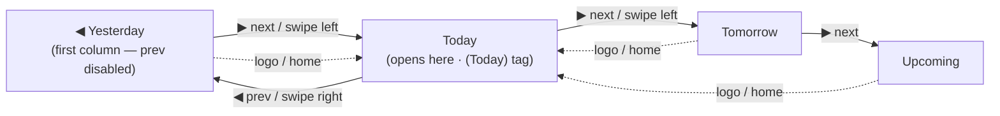

# Use Case 5: Session Day-Deck Navigation & Deep-Linkable Views

This use case specifies how the Personal Trainer (PT) moves across their scheduled days on the
dashboard and how every screen is addressable by a clean, shareable URL. It documents behaviour
the Playwright suite already drives end-to-end but that UC1–UC4 did not previously specify — most
notably the **session day deck**, each card's **status line** (§ 3), and the **deep-link router**.
See also the deep-link routing overview in
[README.md](file:///home/simon/Projects/LibrePT/README.md) (§ *Deep-Linkable Clean URLs*).

---

## 1. Actors & Preconditions

- **Primary actor**: the Personal Trainer, on the mobile PWA.
- The app has loaded and seeded (or restored from `localStorage`) its bookings for the relative
  buckets `yesterday | today | tomorrow | upcoming`.
- The dashboard opens **focused on today**.

---

## 2. Day-Deck Navigation

The session schedule is a **horizontal deck of day-columns** (`yesterday → today → tomorrow →
upcoming`). Exactly **one column occupies the viewport at a time**, on phone and desktop alike,
and the single title bar above the deck always names the focused day.

### 2.1 Main flow

1. **Open on today**: the title bar shows the focused day's **weekday**, its **ISO date**
   (`YYYY-MM-DD`), and a **`(Today)` tag**.
2. **Step with the arrows**: the title-bar `◀` / `▶` arrows move focus one day at a time. The
   `(Today)` tag is shown only while today is focused and drops on any other day.
3. **Swipe the deck**: a **single-finger horizontal swipe** of the deck itself advances exactly
   one day and **retitles the bar** to the day it lands on — the arrows are the mouse-only
   affordance for the same movement.
4. **Return home**: tapping the **logo** pulls focus back to today.

### 2.2 Alternative flows & invariants

- **Deck bounds**: `yesterday` is the first column, so the `◀` (previous) arrow is **disabled**
  there — stepping further back is a dead end.
- **Single-column invariant**: at no viewport width may more than one day-column occupy the deck
  viewport; the visible day always matches the day named in the title bar.
- **No per-column header**: the day is named once, in the title bar. The columns carry no
  redundant per-column header row (see TODO 4.3).

---

## 3. Session Card Status Line

Every session card in the day deck carries a status line reflecting exactly one of three mutually
exclusive states, so the PT reads a card's state at a glance without opening it:

| State | When | Shows |
| :--- | :--- | :--- |
| **Live** | the clipboard is launched for this booking, or it has started by wall clock and isn't closed | a running duration/remaining-time readout with a 🏃 tag, turning amber ("overtime") if it runs past its scheduled end |
| **Upcoming** | not yet started (today, tomorrow, or the `upcoming` bucket) | a live countdown to the scheduled start, ⏩ tag |
| **Past** | `completed: true` | the recorded elapsed time, 🕐 tag — **editable**: tapping the value swaps in an inline field (commit on Enter/blur, discard on Escape) |

- **All three render `H:MM` only** — no seconds — distinct from the clipboard's own overlay timer
  and the floating per-client timer stack (`exerciseAndRestTimer.js`), which are a separate
  surface and keep second-level precision.
- **The left bracket always matches the status bar's color** for whichever state is showing.
- **Finishing a session stamps the booking itself** (`completed: true` + the actual elapsed
  `duration`) so a session finished just now immediately shows the past state on the dashboard —
  not only sessions pre-marked completed in seed data.
- **Editable elapsed time exists because bookings carry no authoritative record of actual elapsed
  time** beyond what the trainer confirms; a fallback (the scheduled slot length) covers completed
  bookings from before this recording existed.

---

## 4. Deep-Linkable Clean URLs

Every view and record is addressable by a clean URL under the app's base path (`/LibrePT` on
GitHub Pages, derived from `<base>` locally). Opening or typing such a URL restores the same
screen; navigating within the app keeps the address bar in step.

| URL (under the base path) | Restores |
| :--- | :--- |
| `/sessions/{YYYY-MM-DD}` | the day deck focused on that day |
| `/session/{sessionId}` | the active-session clipboard |
| `/session/{sessionId}/client/{clientId}` | the clipboard on a specific participant |
| `/session/{sessionId}/client/{clientId}/exercise/{exerciseId}` | the clipboard with that card in focus |
| `/session/{sessionId}/client/{clientId}/superset/{circuitId}` | the clipboard with that superset in focus |
| `/session/{sessionId}/client/{clientId}/edit` | the **inline plan editor** open on that participant's plan |
| `/clients/{clientId}` | a client detail page |
| `/clients` | the Client Directory (its own view since TODO 4.8; the homepage keeps only the session list) |
| `/adjustments` | the Pending Plan Adjustments deck (its own view since TODO 4.8) |
| `/routines`, `/exercises`, `/history` | the primary list views |

- **Focus follows the URL and vice-versa**: opening a session **upgrades** the bare
  `/session/{id}` URL to whatever card is in focus; tapping a card **updates** the URL to that
  card, so the address bar is always a copy-able link to the exact card on screen.
- **Stale card ids fall back**: a card id that no longer resolves is ignored — the URL falls back
  to the real focus rather than erroring.
- **Edit mode is a deep-linkable, reload-proof state**: opening the inline plan editor (the ✎ on
  the clipboard) **upgrades** the URL to `…/edit`; exiting (Done / Esc / tap-outside) drops it back
  to the focused card. Because the state lives in the URL, a **page reload lands back in the
  editor** rather than the live logging deck. Plan edits are **persisted on every keystroke** (not
  just on blur), so nothing typed is lost across the reload — see
  [UC1 — Gym-Floor Clipboard](file:///home/simon/Projects/LibrePT/use_cases/uc1_gym_floor_clipboard.md).

---

## 5. In-App Not-Found (404) View

A deep link that matches **no route**, or points at a **deleted client**, renders an in-app
not-found view (`#view-error`) *inside* the content area:

- The **omnipresent header stays in place** (it does not jump or re-flow), and the bad path is
  shown with a one-tap **return to the dashboard**.
- The bad URL is **left in the address bar** — unknown links are **never silently redirected** to
  today.

---

## 6. Traceability (spec ↔ tests)

Each scenario above is proven by an executable test, so the spec can be traced to the test that
enforces it:

| Scenario | Test |
| :--- | :--- |
| Open-on-today, arrow steps, `(Today)` tag, prev-disabled bound, logo-home | [tests/e2e/test_sessions_dashboard.py](file:///home/simon/Projects/LibrePT/tests/e2e/test_sessions_dashboard.py) · `test_sessions_day_navigation` |
| Single-finger swipe retitles to the landed day | `test_touch_swipe_between_days` (same file; also `tests/test_browser.py`) |
| Single-column invariant at every viewport | `test_single_column_deck_at_every_viewport` |
| Deep link to the in-focus clipboard card; stale card id fallback | [tests/e2e/test_session_deeplink.py](file:///home/simon/Projects/LibrePT/tests/e2e/test_session_deeplink.py) |
| Edit mode deep-links to `…/edit`, survives reload, keeps typed-but-uncommitted edits; direct `/edit` link reopens the editor | [tests/e2e/test_edit_mode_deeplink_reload.py](file:///home/simon/Projects/LibrePT/tests/e2e/test_edit_mode_deeplink_reload.py) |
| Edit mode hides the member tabs + live timer and surfaces the client's goals + notes | [tests/e2e/test_edit_mode_client_focus.py](file:///home/simon/Projects/LibrePT/tests/e2e/test_edit_mode_client_focus.py) |
| Not-found view for unknown route / deleted client; header stays; URL kept | [tests/e2e/test_error_view.py](file:///home/simon/Projects/LibrePT/tests/e2e/test_error_view.py) |
| Launch the clipboard from a session card (with language switch + calendar sync) | [tests/e2e/test_clipboard.py](file:///home/simon/Projects/LibrePT/tests/e2e/test_clipboard.py) · `test_clipboard_launch_flow` |
| Upcoming countdown, past elapsed + inline edit (persists across reload), finishing a session stamps the booking completed/duration | [tests/e2e/test_session_status_line.py](file:///home/simon/Projects/LibrePT/tests/e2e/test_session_status_line.py) |
| Homepage keeps only the session list; ☰-menu navigation and direct deep links to `/clients` and `/adjustments`; logo returns home; the moved menu badge | [tests/e2e/test_view_split_navigation.py](file:///home/simon/Projects/LibrePT/tests/e2e/test_view_split_navigation.py) |

---

## 7. Related Use Cases

- **[UC1 — Gym-Floor Clipboard](file:///home/simon/Projects/LibrePT/use_cases/uc1_gym_floor_clipboard.md)**: this deck is where the PT **launches** the clipboard UC1 specifies; the deep links in § 4 address that clipboard down to the focused card.
- **[UC2 — Asynchronous Plan Adjustments](file:///home/simon/Projects/LibrePT/use_cases/uc2_async_plan_adjustments.md)**: the Pending Plan Adjustments deck reviewed at the desk is its own view (§ 3), reachable from the ☰ menu — it was part of this same dashboard before TODO 4.8 split it out.
- **[UC4 — Client Self-Subscription](file:///home/simon/Projects/LibrePT/use_cases/uc4_client_self_subscription.md)**: bookings surfaced in the day deck originate from the self-subscription flow.

> **Open gap (both directions).** The day deck still models days as **relative buckets**
> (`yesterday | today | tomorrow | upcoming`), not real dates, so `/sessions/{YYYY-MM-DD}` can only
> resolve those four days — an arbitrary past/future date has nothing to show. Giving bookings a
> real date field is the blocking data-model decision tracked in TODO 4.3 / 1.3.
