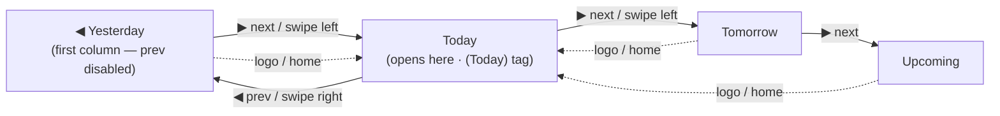

# Use Case 5: Session Day-Deck Navigation & Deep-Linkable Views

This use case specifies how the Personal Trainer (PT) moves across their scheduled days on the
dashboard and how every screen is addressable by a clean, shareable URL. It documents behaviour
the Playwright suite already drives end-to-end but that UC1–UC4 did not previously specify — most
notably the **session day deck** and the **deep-link router**. See also the deep-link routing
overview in [README.md](file:///home/simon/Projects/LibrePT/README.md) (§ *Deep-Linkable Clean URLs*).

---

## 1. Actors & Preconditions

- **Primary actor**: the Personal Trainer, on the mobile PWA.
- The app has loaded and seeded (or restored from `localStorage`) its bookings for the relative
  buckets `yesterday | today | tomorrow | upcoming`.
- The dashboard opens **focused on today**.

---

## 2. Day-Deck Navigation

The session schedule is a **horizontal deck of day-columns** (`yesterday → today → tomorrow →
upcoming`). Exactly **one column occupies the viewport at a time**, on phone and desktop alike,
and the single title bar above the deck always names the focused day.

### 2.1 Main flow

1. **Open on today**: the title bar shows the focused day's **weekday**, its **ISO date**
   (`YYYY-MM-DD`), and a **`(Today)` tag**.
2. **Step with the arrows**: the title-bar `◀` / `▶` arrows move focus one day at a time. The
   `(Today)` tag is shown only while today is focused and drops on any other day.
3. **Swipe the deck**: a **single-finger horizontal swipe** of the deck itself advances exactly
   one day and **retitles the bar** to the day it lands on — the arrows are the mouse-only
   affordance for the same movement.
4. **Return home**: tapping the **logo** pulls focus back to today.

### 2.2 Alternative flows & invariants

- **Deck bounds**: `yesterday` is the first column, so the `◀` (previous) arrow is **disabled**
  there — stepping further back is a dead end.
- **Single-column invariant**: at no viewport width may more than one day-column occupy the deck
  viewport; the visible day always matches the day named in the title bar.
- **No per-column header**: the day is named once, in the title bar. The columns carry no
  redundant per-column header row (see TODO 4.3).

---

## 3. Deep-Linkable Clean URLs

Every view and record is addressable by a clean URL under the app's base path (`/LibrePT` on
GitHub Pages, derived from `<base>` locally). Opening or typing such a URL restores the same
screen; navigating within the app keeps the address bar in step.

| URL (under the base path) | Restores |
| :--- | :--- |
| `/sessions/{YYYY-MM-DD}` | the day deck focused on that day |
| `/session/{sessionId}` | the active-session clipboard |
| `/session/{sessionId}/client/{clientId}` | the clipboard on a specific participant |
| `/session/{sessionId}/client/{clientId}/exercise/{exerciseId}` | the clipboard with that card in focus |
| `/session/{sessionId}/client/{clientId}/superset/{circuitId}` | the clipboard with that superset in focus |
| `/clients/{clientId}` | a client detail page |
| `/routines`, `/exercises`, `/history` | the primary list views |

- **Focus follows the URL and vice-versa**: opening a session **upgrades** the bare
  `/session/{id}` URL to whatever card is in focus; tapping a card **updates** the URL to that
  card, so the address bar is always a copy-able link to the exact card on screen.
- **Stale card ids fall back**: a card id that no longer resolves is ignored — the URL falls back
  to the real focus rather than erroring.

---

## 4. In-App Not-Found (404) View

A deep link that matches **no route**, or points at a **deleted client**, renders an in-app
not-found view (`#view-error`) *inside* the content area:

- The **omnipresent header stays in place** (it does not jump or re-flow), and the bad path is
  shown with a one-tap **return to the dashboard**.
- The bad URL is **left in the address bar** — unknown links are **never silently redirected** to
  today.

---

## 5. Traceability (spec ↔ tests)

Each scenario above is proven by an executable test, so the spec can be traced to the test that
enforces it:

| Scenario | Test |
| :--- | :--- |
| Open-on-today, arrow steps, `(Today)` tag, prev-disabled bound, logo-home | [tests/e2e/test_sessions_dashboard.py](file:///home/simon/Projects/LibrePT/tests/e2e/test_sessions_dashboard.py) · `test_sessions_day_navigation` |
| Single-finger swipe retitles to the landed day | `test_touch_swipe_between_days` (same file; also `tests/test_browser.py`) |
| Single-column invariant at every viewport | `test_single_column_deck_at_every_viewport` |
| Deep link to the in-focus clipboard card; stale card id fallback | [tests/e2e/test_session_deeplink.py](file:///home/simon/Projects/LibrePT/tests/e2e/test_session_deeplink.py) |
| Not-found view for unknown route / deleted client; header stays; URL kept | [tests/e2e/test_error_view.py](file:///home/simon/Projects/LibrePT/tests/e2e/test_error_view.py) |
| Launch the clipboard from a session card (with language switch + calendar sync) | [tests/e2e/test_clipboard.py](file:///home/simon/Projects/LibrePT/tests/e2e/test_clipboard.py) · `test_clipboard_launch_flow` |

---

## 6. Related Use Cases

- **[UC1 — Gym-Floor Clipboard](file:///home/simon/Projects/LibrePT/use_cases/uc1_gym_floor_clipboard.md)**: this deck is where the PT **launches** the clipboard UC1 specifies; the deep links in § 3 address that clipboard down to the focused card.
- **[UC2 — Asynchronous Plan Adjustments](file:///home/simon/Projects/LibrePT/use_cases/uc2_async_plan_adjustments.md)**: the same dashboard hosts the pending-adjustments deck reviewed at the desk.
- **[UC4 — Client Self-Subscription](file:///home/simon/Projects/LibrePT/use_cases/uc4_client_self_subscription.md)**: bookings surfaced in the day deck originate from the self-subscription flow.

> **Open gap (both directions).** The day deck still models days as **relative buckets**
> (`yesterday | today | tomorrow | upcoming`), not real dates, so `/sessions/{YYYY-MM-DD}` can only
> resolve those four days — an arbitrary past/future date has nothing to show. Giving bookings a
> real date field is the blocking data-model decision tracked in TODO 4.3 / 1.3.
