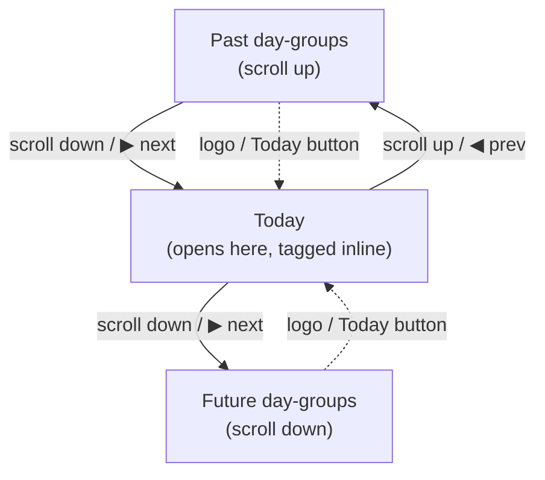

# Use Case 5: Session Timeline Navigation & Deep-Linkable Views

This use case specifies how the Personal Trainer (PT) moves across their scheduled sessions on the
dashboard and how every screen is addressable by a clean, shareable URL. It documents behaviour
the Playwright suite already drives end-to-end but that UC1–UC4 did not previously specify — most
notably the **session timeline**, each card's **status line** (§ 3), and the **deep-link router**.
See also the deep-link routing overview in
[README.md](../README.md) (§ *Deep-Linkable Clean URLs*).

---

## 1. Actors & Preconditions

- **Primary actor**: the Personal Trainer, on the mobile PWA.
- The app has loaded and seeded (or restored from `localStorage`) its sessions, each carrying a
  real absolute `startDate` timestamp (TODO §7.3 item 8; schema 3, `src/data/migrationSteps.js`).
- The dashboard opens **focused on today**.

---

## 2. Session Timeline Navigation

The session schedule is **one continuous, strictly time-ordered vertical scroll** — every session
across past, present and future, grouped under a **sticky per-day header** — not four fixed
yesterday/today/tomorrow/upcoming columns. The single title bar above the timeline always names
whichever day-group currently sits under the focus band (an `IntersectionObserver` watching the
sticky headers, `src/modules/sessionList/sessionTimeline.js`).

```mermaid
graph TD
    P["Past day-groups<br/>(scroll up)"]
    T["Today<br/>(opens here, tagged inline)"]
    F["Future day-groups<br/>(scroll down)"]

    P -- "scroll down / ▶ next" --> T
    T -- "scroll up / ◀ prev" --> P
    T -- "scroll down / ▶ next" --> F
    F -. "logo / Today button" .-> T
    P -. "logo / Today button" .-> T
```

### 2.1 Main flow

1. **Open on today**: the title bar shows the focused day-group's **weekday**, its **ISO date**
   (`YYYY-MM-DD`); the group itself carries an inline **Today** tag.
2. **Step with the arrows**: the title-bar `◀` / `▶` arrows move focus to the previous/next
   day-group that actually has a session, smooth-scrolling there.
3. **Scroll the timeline**: scrolling the page itself (mouse, trackpad, or touch) moves the focus
   band across day-groups and **retitles the bar** to whichever one settles under it — the arrows
   are a discrete-step affordance for the same continuous movement.
4. **Jump to today**: the dedicated **Today** button resets the timeline in one tap; it disables
   itself while today is already focused.
5. **Jump to an exact date**: the calendar-days button opens a native date picker
   (`.showPicker()`); choosing a date scrolls straight to it — the nearest date is used as a
   fallback when nothing is scheduled on the exact day chosen.
6. **Return home**: tapping the **logo** pulls focus back to today.

### 2.2 Alternative flows & invariants

- **Timeline bounds**: the arrows disable only at the true edges of loaded data — the earliest and
  latest day-group that actually has a session — never at an artificial bucket boundary.
- **Single-vertical-column invariant**: at every viewport width, day-groups stack in one column in
  chronological order; nothing pages horizontally per day anymore.
- **No per-card day chrome**: the day is named once, in its group's sticky header. Cards under it
  carry no redundant per-card day label.

---

## 3. Session Card Status Line

Every session card in the day deck carries a status line reflecting exactly one of three mutually
exclusive states, so the PT reads a card's state at a glance without opening it:

| State | When | Shows |
| :--- | :--- | :--- |
| **Live** | the clipboard is launched for this booking, or it has started by wall clock and isn't closed | a running duration/remaining-time readout with a 🏃 tag, turning amber ("overtime") if it runs past its scheduled end |
| **Upcoming** | not yet started (today, tomorrow, or the `upcoming` bucket) | a live countdown to the scheduled start, ⏩ tag |
| **Past** | `completed: true` | the recorded elapsed time, 🕐 tag — **editable**: tapping the value swaps in an inline field (commit on Enter/blur, discard on Escape) |

- **All three render `H:MM` only** — no seconds — distinct from the clipboard's own overlay timer
  and the floating per-client timer stack (`exerciseAndRestTimer.js`), which are a separate
  surface and keep second-level precision.
- **The left bracket always matches the status bar's color** for whichever state is showing.
- **Finishing a session stamps the booking itself** (`completed: true` + the actual elapsed
  `duration`) so a session finished just now immediately shows the past state on the dashboard —
  not only sessions pre-marked completed in seed data.
- **Editable elapsed time exists because bookings carry no authoritative record of actual elapsed
  time** beyond what the trainer confirms; a fallback (the scheduled slot length) covers completed
  bookings from before this recording existed.

### 3.1 PT-Side Assignment & Calendar Invite (TODO §1)

Client assignment is not only client-initiated: the card's Edit button opens the same
participant-assignment form used to create a session, letting the PT check clients directly onto
`participants` — this complements, and does not replace, the Google-hosted self-subscription flow
([UC4](uc4_client_self_subscription.md)).

- On save, any **newly** assigned participant (diffed against the session's prior `participants`,
  so re-saving unchanged assignments never re-prompts) triggers a "Send calendar invites" dialog.
- LibrePT has no backend/SMTP relay, so a client is offered a downloadable `.ics` file plus a
  prefilled `mailto:` compose to send it in — not an automated send like UC4's Google-triggered
  invite email.
- A client with no email on record gets a disabled "Send invite" affordance with a tooltip, the
  same fallback used elsewhere for a missing email — assignment itself is never blocked on it.

---

## 4. Deep-Linkable Clean URLs

Every view and record is addressable by a clean URL under the app's base path (`/LibrePT` on
GitHub Pages, derived from `<base>` locally). Opening or typing such a URL restores the same
screen; navigating within the app keeps the address bar in step.

This section is the catalogue of *what* the URLs are. How the router resolves one to a screen — the
route classes, specificity ordering, and the invariants a new route must respect — is
[docs/ROUTING.md](../docs/ROUTING.md).

| URL (under the base path) | Restores |
| :--- | :--- |
| `/sessions/{YYYY-MM-DD}` | the timeline scrolled/focused to that real date (any date, not just a 4-bucket proxy) |
| `/session/{sessionId}` | the active-session clipboard |
| `/session/{sessionId}/client/{clientId}` | the clipboard on a specific participant |
| `/session/{sessionId}/client/{clientId}/exercise/{exerciseId}` | the clipboard with that card in focus |
| `/session/{sessionId}/client/{clientId}/circuit/{circuitId}` | the clipboard with that circuit in focus |
| `…/superset/{circuitId}` | **legacy alias** for the row above — the pre-2026-07-26 spelling. Still resolves, and the address bar is rewritten to `/circuit/`, so shared and bookmarked links never break |
| `/session/{sessionId}/client/{clientId}/rest/{restId}` | the clipboard with that standalone rest in focus — a rest is a first-class plan item, focusable exactly like an exercise or circuit (TODO §8.6) |
| `/session/{sessionId}/client/{clientId}/edit` | the **inline plan editor** open on that participant's plan |
| `/session/{sessionId}/client/{clientId}/edit/exercise/{slotId}` | the plan editor **with that row called out** — inserting or swapping a row names it here, so a reload lands back on the row the trainer was in the middle of. A restore highlights and scrolls to it but takes no caret and shows no badge: nothing just happened to it. An id that no longer resolves is ignored and the segment is dropped |
| `/clients/{clientId}` | a client detail page |
| `/clients` | the Client Directory (its own view since TODO 4.8; the homepage keeps only the session list) |
| `/adjustments` | the Pending Plan Adjustments deck (its own view since TODO 4.8) |
| `/routines`, `/exercises`, `/history` | the primary list views |

**Dialog routes.** A dialog is a state a reload should restore, so the globally-reachable ones are
addressable too. Opening one **pushes** a history entry, which makes **Back close it** — the dismiss
gesture a phone user already knows — and the ✕, Cancel and Escape agree, because closing pops that
entry. Arriving straight at one of these URLs (a shared link, or a reload while it was open) reopens
the dialog over the dashboard rather than a blank shell.

| URL (under the base path) | Restores |
| :--- | :--- |
| `/about` | the About dialog |
| `/terms` | the Terms & disclaimer dialog, reopened from the ☰ menu |
| `/build` | the build-identity dialog (release, commit, data schema, build time) |
| `/backup` | the Sync & Backup dialog |

Record editors are routes too, each opening over its own list view:

| URL (under the base path) | Restores |
| :--- | :--- |
| `/routines/new` | the routine builder on a blank form |
| `/routines/{routineId}` | the routine builder loaded with that template |
| `/exercises/new` | the create-movement form |
| `/adjustments/{updateId}` | the adjustment wizard on that alert |
| `/session/{id}/client/{cid}/edit/catalog` | the plan editor with the **taxonomy picker** open (add from catalog) |
| `/session/{id}/client/{cid}/edit/catalog/slot/{slotId}` | the picker open to **swap that row's** movement |

- **Saving pops exactly one entry.** The submit handler closes the dialog and the router turns that
  close into the matching history pop, so Back after a save leaves the list rather than skipping a
  screen.

- **The first-run agreement is deliberately not routed.** It is a boot precondition, not a place the
  trainer navigated to: it takes no history entry, and Back must not dismiss an agreement that has
  not been accepted. From the ☰ menu afterwards it is an ordinary routed dialog.

- **Focus follows the URL and vice-versa**: opening a session **upgrades** the bare
  `/session/{id}` URL to whatever card is in focus; tapping a card **updates** the URL to that
  card, so the address bar is always a copy-able link to the exact card on screen.
- **Stale card ids fall back**: a card id that no longer resolves is ignored — the URL falls back
  to the real focus rather than erroring.
- **Edit mode is a deep-linkable, reload-proof state**: opening the inline plan editor (the ✎ on
  the clipboard) **upgrades** the URL to `…/edit`; exiting (Done / Esc / tap-outside) drops it back
  to the focused card. Because the state lives in the URL, a **page reload lands back in the
  editor** rather than the live logging deck. Plan edits are **persisted on every keystroke** (not
  just on blur), so nothing typed is lost across the reload — see
  [UC1 — Gym-Floor Clipboard](uc1_gym_floor_clipboard.md).

---

## 5. In-App Not-Found (404) View

A deep link that matches **no route**, or points at a **deleted client**, renders an in-app
not-found view (`#view-error`) *inside* the content area:

- The **omnipresent header stays in place** (it does not jump or re-flow), and the bad path is
  shown with a one-tap **return to the dashboard**.
- The bad URL is **left in the address bar** — unknown links are **never silently redirected** to
  today.

---

## 6. Spec ↔ Code & Test Traceability

| Specification Requirement | Target Implementation / Test |
| :--- | :--- |
| Newly-assigned participants trigger a calendar-invite dialog; re-saving unchanged assignments does not re-prompt | [../tests/e2e/test_session_invite_dialog.py](../tests/e2e/test_session_invite_dialog.py) |
| Open-on-today, arrow steps, Today tag/button, prev/next edge bounds, logo-home | [../tests/e2e/test_sessions_dashboard.py](../tests/e2e/test_sessions_dashboard.py) · `test_sessions_day_navigation` |
| Scrolling the timeline retitles the bar to the day-group that settles under focus | [../tests/e2e/test_sessions_dashboard.py](../tests/e2e/test_sessions_dashboard.py) · `test_scrolling_the_timeline_updates_the_focused_day` |
| Date-jump control scrolls to a chosen date, falling back to the nearest real content | [../tests/e2e/test_sessions_dashboard.py](../tests/e2e/test_sessions_dashboard.py) · `test_date_jump_control_scrolls_to_chosen_date` |
| Single-vertical-column, chronologically-ordered invariant at every viewport | [../tests/e2e/test_sessions_dashboard.py](../tests/e2e/test_sessions_dashboard.py) · `test_continuous_vertical_timeline_at_every_viewport` |
| Deep link to the in-focus clipboard card; stale card id fallback | [../tests/e2e/test_session_deeplink.py](../tests/e2e/test_session_deeplink.py) |
| Edit mode deep-links to `…/edit`, survives reload, keeps typed-but-uncommitted edits; direct `/edit` link reopens the editor | [../tests/e2e/test_edit_mode_deeplink_reload.py](../tests/e2e/test_edit_mode_deeplink_reload.py) |
| Edit mode hides the member tabs + live timer and surfaces the client's goals + notes | [../tests/e2e/test_edit_mode_client_focus.py](../tests/e2e/test_edit_mode_client_focus.py) |
| A just-inserted or just-swapped plan item is called out in the editor (highlight + badge + caret), one-shot | [../tests/e2e/test_editor_new_item_callout.py](../tests/e2e/test_editor_new_item_callout.py) |
| Edit mode and planning programmes hide *Complete Workout Session*; it returns on exit from edit mode | [../tests/e2e/test_edit_mode_hides_complete.py](../tests/e2e/test_edit_mode_hides_complete.py) |
| Not-found view for unknown route / deleted client; header stays; URL kept | [../tests/e2e/test_error_view.py](../tests/e2e/test_error_view.py) |
| Launch the clipboard from a session card (with language switch + calendar sync) | [../tests/e2e/test_clipboard.py](../tests/e2e/test_clipboard.py) · `test_clipboard_launch_flow` |
| Upcoming countdown, past elapsed + inline edit (persists across reload), finishing a session stamps the booking completed/duration | [../tests/e2e/test_session_status_line.py](../tests/e2e/test_session_status_line.py) |
| Homepage keeps only the session list; ☰-menu navigation and direct deep links to `/clients` and `/adjustments`; logo returns home; the moved menu badge | [../tests/e2e/test_view_split_navigation.py](../tests/e2e/test_view_split_navigation.py) |
| Globally-reachable dialogs (`/about`, `/terms`, `/build`, `/backup`) are routes: Back closes them, ✕/Escape agree, a cold link reopens over a real view, and the first-run agreement is not routed | [../tests/e2e/test_dialog_routing.py](../tests/e2e/test_dialog_routing.py) · `test_back_closes_the_dialog`, `test_the_close_button_and_back_agree`, `test_cold_deep_link_opens_the_dialog_over_a_real_view`, `test_first_run_terms_is_not_routed` |
| The just-inserted editor row is addressable and survives a reload, without a caret or a New badge; a deleted row id falls back | [../tests/e2e/test_editor_row_deeplink.py](../tests/e2e/test_editor_row_deeplink.py) · `test_the_called_out_row_survives_a_reload`, `test_a_restored_row_takes_no_caret_and_carries_no_badge`, `test_a_deleted_row_id_falls_back_instead_of_erroring` |
| Record editors are addressable, reopen with the record loaded, and saving pops exactly one history entry | [../tests/e2e/test_record_dialog_routes.py](../tests/e2e/test_record_dialog_routes.py) · `test_routine_editor_deeplink_reopens_with_the_record_loaded`, `test_saving_pops_exactly_one_history_entry`, `test_adjustment_wizard_is_addressable` |
| The session's taxonomy picker is addressable, survives a reload over the restored editor, and a render behind it does not erase its URL | [../tests/e2e/test_session_dialog_routes.py](../tests/e2e/test_session_dialog_routes.py) · `test_row_swap_picker_names_the_row_and_survives_a_reload`, `test_a_render_behind_the_picker_does_not_erase_its_url` |

---

## 7. Related Use Cases

- **[UC1 — Gym-Floor Clipboard](uc1_gym_floor_clipboard.md)**: this timeline is where the PT **launches** the clipboard UC1 specifies; the deep links in § 4 address that clipboard down to the focused card.
- **[UC2 — Asynchronous Plan Adjustments](uc2_async_plan_adjustments.md)**: the Pending Review deck reviewed at the desk is its own view (§ 3), reachable from the ☰ menu — it was part of this same dashboard before TODO 4.8 split it out.
- **[UC4 — Client Self-Subscription](uc4_client_self_subscription.md)**: bookings surfaced in the timeline originate from the self-subscription flow.

> **Closed 2026-07-27 (TODO §7.3 item 8).** Sessions now carry a real `startDate` (schema 3), and
> `/sessions/{YYYY-MM-DD}` resolves to any date, not just one of four relative buckets — the gap
> this note used to describe. `day` (`yesterday|today|tomorrow|upcoming`) still exists on a
> session record, but only as a coarse bucket other systems (overlap detection, card temporal
> tint) key off; it no longer drives the dashboard's own navigation.
